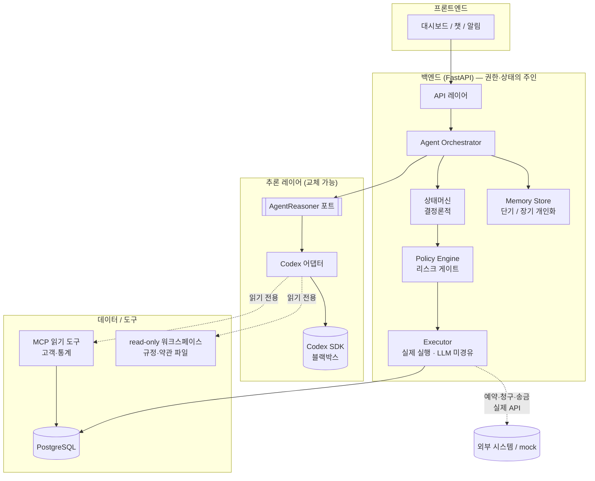
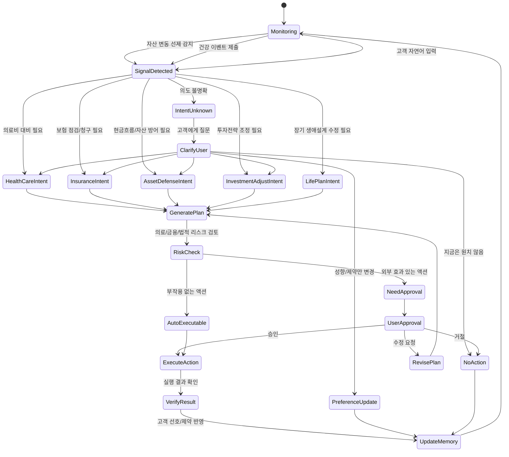
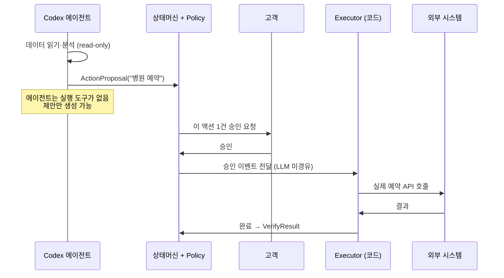
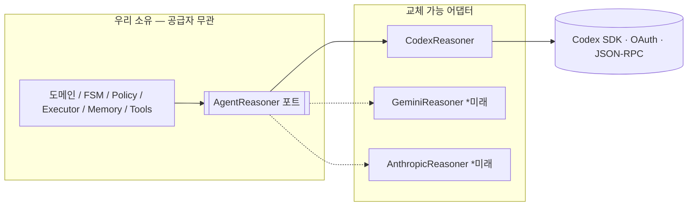

# JB WM — Backend

> **JB WM Agent** — 고객의 **건강과 자산을 하나의 "회복탄력성(resilience)" 상태**로 보고, 변화가 생기면(자산 변동은 선제 감지, 건강은 고객 제출 시 재평가) 개인화된 판단으로 보험·자산·투자·의료비 대비를 **통합 제안**하고, **고객 승인 후** 실제 액션까지 연결하는 **능동형 lifelong WM 에이전트**.

이 저장소는 백엔드(FastAPI)입니다. 워크플로우 상태, 데이터 접근, 권한 경계, 액션 실행, 그리고 LLM 추론(Codex SDK)을 담당합니다.

JB금융그룹 해커톤 출품작 (Lifelong WM × Health).

> 제품 개념의 정본은 [docs/01_PRODUCT_CONTEXT.md](docs/01_PRODUCT_CONTEXT.md)입니다.

---

## 한눈에 보는 제품

**건강과 자산은 분리된 두 영역이 아니라 하나입니다.** 건강 악화는 자산을 위협하고(의료비·소득), 자산 상태는 의료 대응의 적극성·선택지를 좌우합니다(양방향). 기존엔 이 얽힌 판단을 **고객이 직접** 해야 했습니다.

JB WM Agent는:
- **자산 변동을 선제 감지**해(회사 보유 데이터) 의료비 대비·현금흐름 위험을 먼저 경고하고,
- **건강 이벤트는 고객 제출 시** 자산·지불의향을 함께 고려해 재무·보장 대비를 제안하며,
- **민감 액션은 반드시 고객 승인**을 받고, **의료 권고는 생성하지 않습니다**(재무·통계참고·연결만).

> 핵심 차별점: **(1) 건강·자산 통합 회복탄력성**(양방향) **(2) 능동성**(자산 선제 감지) **(3) 지불의향 기반 개인화** **(4) 이중 capability 경계**(실행 권한 없음 + 의료 권고 생성 안 함) **(5) 의도=상태**.

---

## 시스템 아키텍처



**역할 분리가 이 시스템의 전부입니다:**

| 구성요소 | 책임 | 비고 |
|---|---|---|
| **상태머신 (FSM)** | 현재 상태, 허용 전이, 실행 가능 여부 | 결정론적. LLM이 못 건드림 |
| **Policy Engine** | 리스크 평가 → auto vs 고객승인 라우팅 | 코드 규칙 |
| **Executor** | 승인된 액션의 실제 실행 | **LLM을 거치지 않음** |
| **Memory Store** | 단기(진행상황) + 장기(성향·선호) | 개인화의 핵심 |
| **AgentReasoner (포트)** | 추론 인터페이스 (공급자 무관) | 우리가 영구 소유 |
| **Codex 어댑터** | 포트의 Codex 구현 | 교체 가능 (Gemini/Anthropic) |

---

## 에이전트 상태머신 (FSM)

이 그래프가 서비스 로직의 본체입니다. LLM이 아니라 **코드가** 이 전이를 강제합니다.



### 진입 트리거 (소스별)

| 트리거 | 예시 | 성격 |
|---|---|---|
| **자산 — 시스템 선제** | 포트폴리오 손실 급등, 소비 급증, 상환 압박 | 회사 보유 데이터로 실시간 감지 |
| **자산 — 고객 언급** | "다음 달 큰 지출 예정" | 자연어 → 계획·승인 가능 |
| **건강 문서 제출** | **진단서·정기검진 내역**(객관 문서) | 제출 시 재평가 (주관 진술 아님) |
| **고객 자연어 (요청/성향)** | "보험 봐줘", "투자는 보수적으로" | 발화 → 요청/성향 변경 |

> **자연어는 1급 트리거**입니다. 액션이 필요하면 `GeneratePlan→RiskCheck→승인`을 거치고, **순전히 성향/지불의향 변경일 때만** `PreferenceUpdate`(액션 없음)로 갑니다. ([docs/03](docs/03_STATE_MACHINE.md))
>
> **건강은 객관 문서로 앵커**: 질병 평가는 제출된 진단서·검진 내역 + 통계로 하고, 주관(인지·지불의향)은 *대응 개인화*에만 반영합니다 — 주관이 질병 크기를 왜곡하지 않도록.

### 의도(Intent) = 고객의 숨은 니즈

| 상태 | 고객의 숨은 의도 |
|---|---|
| `HealthCareIntent` | "의료비를 어떻게 대비하지?" (재무 대비 — 의료 권고 아님) |
| `InsuranceIntent` | "내 보험으로 커버되나?" |
| `AssetDefenseIntent` | "당장 현금흐름 괜찮나?" |
| `InvestmentAdjustIntent` | "투자 위험도를 낮춰야 하나?" |
| `LifePlanIntent` | "장기 계획 자체를 바꿔야 하나?" |

---

## 안전 모델 — 이중 Capability 경계 (프롬프트가 아니라 권한)

LLM에게 "하지 마"라고 **부탁하지 않습니다.** 애초에 **권한 자체를 주지 않습니다.** 두 개의 경계가 있습니다:

1. **실행 경계** — AI는 실제 행동(예약·청구·송금)을 실행할 권한이 없다. 제안만 하고, 고객 승인 후 Executor(코드)가 실행.
2. **의료 경계** — AI/회사는 **의료 권고 자체를 생성하지 않는다.** 재무 대비 + 통계 참고정보(출처 명시) + 전문가 연결만. 의료 결정권은 고객+주치의. ([10](docs/10_SECURITY_PRIVACY.md))

아래는 실행 경계의 흐름입니다:



- 에이전트의 도구 = **읽기·분석·제안만** (`get_health_data`, `get_portfolio_summary`, `search_policy_documents`, `generate_plan`)
- `book_hospital()`, `submit_claim()`, `transfer_money()` 같은 **실행 도구는 에이전트에 존재하지 않음**
- Codex 샌드박스 = `read_only`, 동적 도구 = **읽기 전용 MCP** → 환각·프롬프트 인젝션이 있어도 **물리적으로 실행 불가**
- 승인은 **그 액션 1건에만** 스코핑됨 (전권 위임 아님). 승인 이벤트는 LLM을 거치지 않고 결정론적 Executor로 직행

자세히는 [docs/07_ACTION_EXECUTION.md](docs/07_ACTION_EXECUTION.md), [docs/10_SECURITY_PRIVACY.md](docs/10_SECURITY_PRIVACY.md).

---

## LLM 공급자 경계 (마이그레이션)

추론 백엔드는 교체 가능합니다. Codex SDK는 어댑터 뒤의 **블랙박스**입니다.



| 구분 | 내용 | 마이그레이션 시 |
|---|---|---|
| 블랙박스 (SDK) | 모델 통신, OAuth, 전송계층, 토큰 | 신경 안 씀 |
| 우리 소유 (포트) | 프롬프트→구조화출력, 도구 노출, 도구 루프, thread 연속 | 그대로 |
| 어댑터 | 포트의 Codex 구현 | **여기만 다시 씀** |

자세히는 [docs/04_AGENT_RUNTIME.md](docs/04_AGENT_RUNTIME.md), [docs/CODEX_ADAPTER.md](docs/CODEX_ADAPTER.md).

---

## 기술 스택

| 레이어 | 기술 |
|---|---|
| 런타임 | Python 3.12+ |
| API | FastAPI |
| 검증 | Pydantic v2 |
| DB | PostgreSQL |
| ORM | SQLModel |
| 마이그레이션 | Alembic |
| 추론 | Codex Python SDK (`openai-codex`) — OAuth 세션 |
| 워크플로우 | 자체 유한 상태머신 (FSM) |
| 도구 노출 | MCP (동적 데이터) + read-only 워크스페이스 (정적 규정) |
| 패키지 | uv |
| 테스트 | pytest |

---

## 디렉토리 구조 (목표)

```
app/
├── main.py                  FastAPI 진입점
├── core/                    설정 · DB · 로깅 · 보안
├── api/                     라우트 · 의존성
├── domains/                 customer · health · portfolio · insurance · loan
├── agent/
│   ├── runtime.py           AgentReasoner 포트 + Orchestrator
│   ├── codex_adapter.py     Codex SDK 구현 (유일한 SDK import 지점)
│   ├── schemas.py           Intent / Plan / ActionProposal 구조화 스키마
│   └── prompts.py
├── state_machine/           states · transitions · guards
├── policy/                  리스크 규칙 · 승인 라우팅
├── executor/                결정론적 액션 실행 (LLM 미경유)
├── memory/                  단기 / 장기 개인화
├── tools/                   MCP 읽기 도구 (고객 · 통계 · 규정검색)
└── tests/
```

---

## 빠른 시작

> 시스템 도구(Node·uv·Codex CLI·PostgreSQL) 사전 설치가 필요합니다. [docs/SETUP.md](docs/SETUP.md) 참고.

```bash
# 1. 가상환경 + 의존성
bash scripts/install.sh
source .venv/bin/activate

# 2. Codex 인증 (1회) — OAuth 세션
codex login

# 3. 환경변수
cp .env.example .env

# 4. 개발 서버
uvicorn app.main:app --reload   # GET /health
```

---

## 문서

설계 컨텍스트는 [`docs/`](docs/)에 있습니다. **구현 전 반드시 [docs/00_READING_ORDER.md](docs/00_READING_ORDER.md) 순서대로 읽으세요.**

| # | 문서 | 내용 |
|---|---|---|
| 00 | READING_ORDER | 읽는 순서 + 용어집 |
| 01 | PRODUCT_CONTEXT | 제품 정의 · 사용자 · MVP 시나리오 |
| 02 | SYSTEM_ARCHITECTURE | 전체 구조 · 데이터 3분류 · capability 보안 |
| 03 | STATE_MACHINE | 상태 · 전이 · 트리거 · 승인 게이트 |
| 04 | AGENT_RUNTIME | 공급자 무관 루프 + AgentReasoner 포트 |
| 05 | DATA_MODEL | 엔티티 (건강·메모리·의도·대출·액션제안) |
| 06 | TOOL_CONTRACTS | 읽기/분석/제안 도구 · 데이터 접근 |
| 07 | ACTION_EXECUTION | Policy Engine + Executor |
| 08 | MEMORY | 단기/장기 · 개인화 |
| 09 | API_SPEC | REST 엔드포인트 |
| 10 | SECURITY_PRIVACY | 규제 · capability 보안 |
| 11 | IMPLEMENTATION_ROADMAP | 수직 슬라이스 |
| — | CODEX_ADAPTER | Codex SDK 구체 연동 (실제 소스 기준) |
