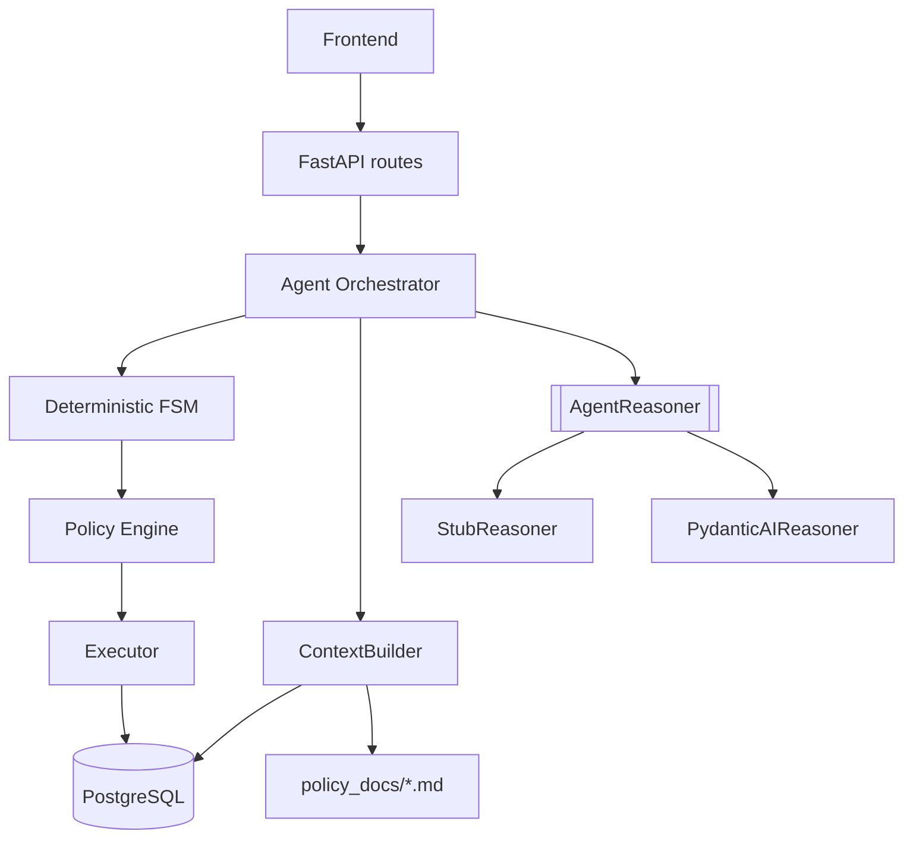
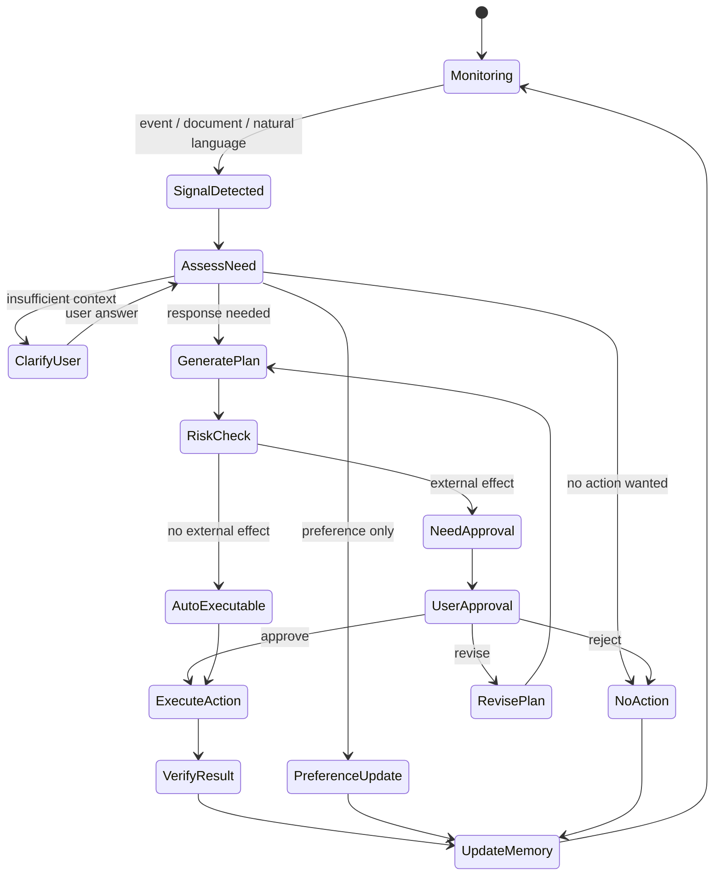

# JB WM Backend

JB WM Agent backend is a FastAPI service for a lifelong wealth-management agent that treats health, insurance, cashflow, asset defense, investment strategy, and life planning as one integrated resilience problem.

The backend owns workflow state, customer data access, memory, approval gates, and execution. The LLM is used only for structured judgment and proposal generation through the `AgentReasoner` port.

## Architecture



Core boundary:

| Layer | Responsibility |
|---|---|
| FSM | Allowed states and transitions |
| ContextBuilder | Builds the explicit context pack for each LLM call |
| AgentReasoner | Produces `NeedAssessment` and `Plan` only |
| Policy Engine | Decides auto-executable vs approval-required |
| Executor | Applies approved actions deterministically |
| DB | Owns customer/session continuity and audit history |

## Runtime Model

JB-WM session continuity is not delegated to an LLM provider session. Each LLM run is a structured one-shot call over a backend-built context pack.

```text
AgentSession in DB
  ├─ AgentMessage          previous conversation
  ├─ NeedAssessmentRecord  previous judgments
  ├─ PlanRecord            previous plans
  ├─ ActionProposal        proposal and approval history
  ├─ AgentEvent            state/event timeline
  └─ ContextBuilder        reinjects selected history into each LLM call
```

This makes provider migration straightforward: replace `PydanticAIReasoner`, keep FSM, memory, tools, approval, and execution.

## State Machine



`AssessNeed` evaluates all need axes together: `medical_cost`, `insurance`, `cashflow`, `asset_defense`, `investment_adjust`, and `life_plan`. `GeneratePlan` then proposes actions using that integrated assessment.

## Stack

| Layer | Tool |
|---|---|
| Runtime | Python 3.12+ |
| API | FastAPI, uvicorn |
| Validation | Pydantic v2 |
| DB | PostgreSQL |
| ORM | SQLModel |
| Reasoning | PydanticAI or deterministic stub |
| Workflow | Custom FSM |
| Package manager | uv |
| Tests | pytest |

## Quick Start

```bash
cd JB-WM-backend
bash scripts/install.sh
cp .env.example .env
uv run uvicorn app.main:app --reload
```

Default `.env.example` uses `REASONER=stub`, so no LLM credential is required for local demo and tests.

To enable real LLM reasoning:

```env
REASONER=pydantic_ai
CODEX_MODEL=gpt-5.4
CODEX_MODEL_REASONING_EFFORT=high
```

Run `codex login` once on the server, then restart the backend.

## Tests

```bash
uv run pytest -q
```

## Directory

```text
app/
├── main.py
├── api/                  FastAPI routes
├── agent/
│   ├── runtime.py        AgentReasoner port
│   ├── orchestrator.py   FSM orchestration
│   ├── context_builder.py
│   ├── pydantic_ai_reasoner.py
│   ├── stub_reasoner.py
│   └── schemas.py
├── core/                 settings, db, auth, logging
├── executor/             deterministic approved action execution
├── models/               SQLModel tables
├── policy/               risk and approval rules
├── privacy/              consent and retention services
├── state_machine/        states and transitions
├── tools/                backend read/normalization functions
└── tests/
```

## Docs

Start with [docs/00_READING_ORDER.md](docs/00_READING_ORDER.md).

Important current docs:

| Doc | Purpose |
|---|---|
| [01_PRODUCT_CONTEXT.md](docs/01_PRODUCT_CONTEXT.md) | Product definition |
| [02_SYSTEM_ARCHITECTURE.md](docs/02_SYSTEM_ARCHITECTURE.md) | System architecture |
| [03_STATE_MACHINE.md](docs/03_STATE_MACHINE.md) | FSM and transition policy |
| [04_AGENT_RUNTIME.md](docs/04_AGENT_RUNTIME.md) | Reasoner runtime |
| [06_TOOL_CONTRACTS.md](docs/06_TOOL_CONTRACTS.md) | Data/tool contracts |
| [13_LLM_DECISION_CONTEXT.md](docs/13_LLM_DECISION_CONTEXT.md) | LLM memory, policy, and expert-knowledge design |
