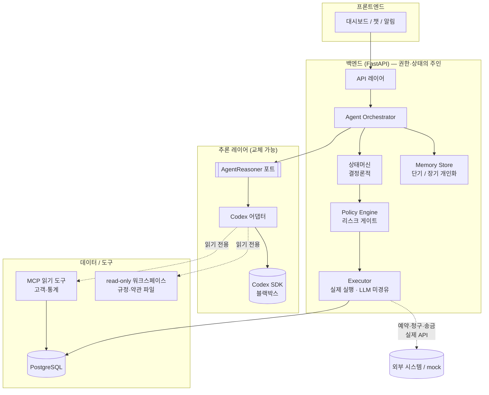
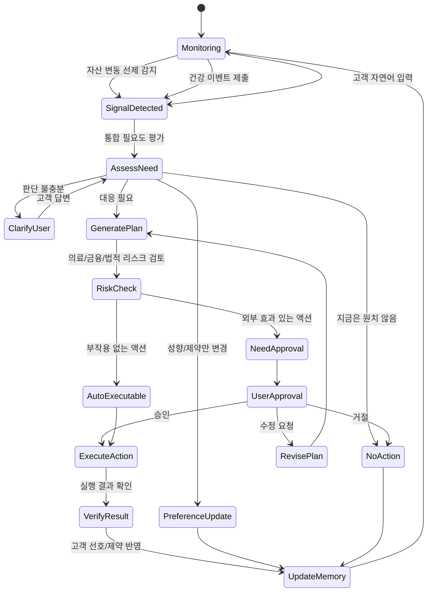
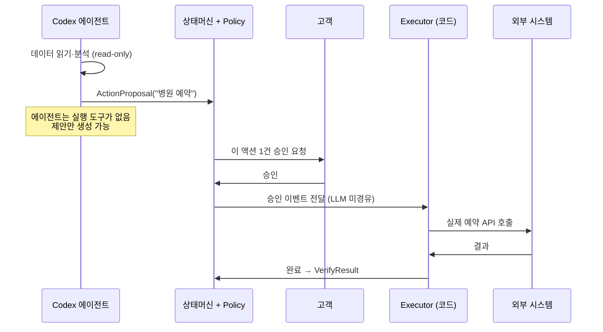
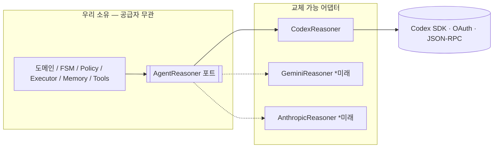

# JB WM — Backend

> **JB WM Agent** — 고객의 **건강과 자산을 하나의 "회복탄력성(resilience)" 상태**로 보고, 변화가 생기면(자산 변동은 선제 감지, 건강은 고객 제출 시 재평가) 개인화된 판단으로 보험·자산·투자·의료비 대비를 **통합 제안**하고, **고객 승인 후** 실제 액션까지 연결하는 **능동형 lifelong WM 에이전트**.

이 저장소는 백엔드(FastAPI)입니다. 워크플로우 상태, 데이터 접근, 권한 경계, 액션 실행, 그리고 LLM 추론(Codex SDK)을 담당합니다.

JB금융그룹 해커톤 출품작 (Lifelong WM × Health).

> 제품 개념의 정본은 [docs/01_PRODUCT_CONTEXT.md](docs/01_PRODUCT_CONTEXT.md)입니다.

---

## 한눈에 보는 제품

**건강과 자산은 분리된 두 영역이 아니라 하나입니다.** 건강 악화는 자산을 위협하고(의료비·소득), 자산 상태는 의료 대응의 적극성·선택지를 좌우합니다(양방향). 기존엔 이 얽힌 판단을 **고객이 직접** 해야 했습니다.

JB WM Agent는:
- **자산 변동을 선제 감지**해(회사 보유 데이터) 의료비 대비·현금흐름 위험을 먼저 경고하고,
- **건강 이벤트는 고객 제출 시** 자산·보험·의료비 감내 범위/지불의향을 함께 고려해 비용 범위별 대응 시나리오를 제안하며,
- **민감 액션은 반드시 고객 승인**을 받고, **의료 권고는 생성하지 않습니다**(재무·통계참고·연결만).

> 핵심 차별점: **(1) 건강·자산 통합 회복탄력성**(양방향) **(2) 능동성**(자산 선제 감지) **(3) 의료비 감내 범위/지불의향 기반 개인화** **(4) 이중 capability 경계**(실행 권한 없음 + 의료 권고 생성 안 함) **(5) 통합 필요도 평가**.

---

## 시스템 아키텍처



**역할 분리가 이 시스템의 전부입니다:**

| 구성요소 | 책임 | 비고 |
|---|---|---|
| **상태머신 (FSM)** | 현재 상태, 허용 전이, 실행 가능 여부 | 결정론적. LLM이 못 건드림 |
| **Policy Engine** | 리스크 평가 → auto vs 고객승인 라우팅 | 코드 규칙 |
| **Executor** | 승인된 액션의 실제 실행 | **LLM을 거치지 않음** |
| **Memory Store** | 단기(진행상황) + 장기(성향·선호) | 개인화의 핵심 |
| **AgentReasoner (포트)** | 추론 인터페이스 (공급자 무관) | 우리가 영구 소유 |
| **Codex 어댑터** | 포트의 Codex 구현 | 교체 가능 (Gemini/Anthropic) |

---

## 에이전트 상태머신 (FSM)

이 그래프가 서비스 로직의 본체입니다. LLM이 아니라 **코드가** 이 전이를 강제합니다.

> **중요**: JB WM은 고객 1명을 하나의 **통합 회복탄력성 상태**로 보는 holistic WM
> agent입니다. 신호를 단일 `Intent`로 좁히지 않고 `AssessNeed`에서 의료비·보험·
> 현금흐름·자산방어·투자전략·생애설계 필요도를 함께 평가합니다.



### 진입 트리거 (소스별)

| 트리거 | 예시 | 성격 |
|---|---|---|
| **자산 — 시스템 선제** | 포트폴리오 손실 급등, 소비 급증, 상환 압박 | 회사 보유 데이터로 실시간 감지 |
| **자산 — 고객 언급** | "다음 달 큰 지출 예정" | 자연어 → 계획·승인 가능 |
| **건강 문서 제출** | **진단서·정기검진 내역**(객관 문서) | 제출 시 재평가 (주관 진술 아님) |
| **고객 자연어 (요청/성향)** | "보험 봐줘", "투자는 보수적으로" | 발화 → 요청/성향 변경 |

> **자연어는 1급 트리거**입니다. 액션이 필요하면 `GeneratePlan→RiskCheck→승인`을 거치고, **순전히 성향/지불의향 변경일 때만** `PreferenceUpdate`(액션 없음)로 갑니다. ([docs/03](docs/03_STATE_MACHINE.md))
>
> **건강은 객관 문서로 앵커**: 질병 평가는 제출된 진단서·검진 내역 + 통계로 하고, 주관(인지·지불의향)은 *대응 개인화*에만 반영합니다 — 주관이 질병 크기를 왜곡하지 않도록.

### AssessNeed = 통합 필요도 평가

`AssessNeed`는 고객이 자신의 문제를 직접 분류하지 않아도, agent가 최신 고객 컨텍스트를
함께 보고 필요한 대응축을 평가하는 단계입니다.

| 필요도 | 의미 |
|---|---|
| `medical_cost_need` | 의료비 감내 범위 설계 필요성 (의료 권고 아님) |
| `insurance_need` | 보장 공백·청구 가능성·보험료 부담 점검 필요성 |
| `cashflow_need` | 단기 지불능력. 의료비·상환·카드청구·생활비 |
| `asset_defense_need` | 보유자산 훼손 방어. 손실 확정 매도·고위험 비중 |
| `investment_adjust_need` | 위 평가 결과를 종합한 투자전략 조정 필요성 |
| `life_plan_need` | 은퇴·생활비·장기 목표 재검토 필요성 |

---

## 안전 모델 — 이중 Capability 경계 (프롬프트가 아니라 권한)

LLM에게 "하지 마"라고 **부탁하지 않습니다.** 애초에 **권한 자체를 주지 않습니다.** 두 개의 경계가 있습니다:

1. **실행 경계** — AI는 실제 행동(예약·청구·송금)을 실행할 권한이 없다. 제안만 하고, 고객 승인 후 Executor(코드)가 실행.
2. **의료 경계** — AI/회사는 **의료 권고 자체를 생성하지 않는다.** 재무 대비 + 통계 참고정보(출처 명시) + 전문가 연결만. 의료 결정권은 고객+주치의. ([10](docs/10_SECURITY_PRIVACY.md))

의료 경계는 소극적 제한이 아니라 역할 정의입니다. agent는 치료법을 고르지 않고, 고객이 주치의와 의료 선택지를 논의할 수 있도록 **비용 범위별 재무 시나리오**를 만듭니다. 예를 들어 기본 검사, 추가 정밀검사, 입원·시술 가능성 같은 범위를 통계·보험·자산 상태와 연결해 "어느 정도까지 감당 가능한가"를 보여줍니다.

아래는 실행 경계의 흐름입니다:



- 에이전트의 도구 = **읽기·분석·제안만** (`get_health_data`, `get_portfolio_summary`, `search_policy_documents`, `generate_plan`)
- `book_hospital()`, `submit_claim()`, `transfer_money()` 같은 **실행 도구는 에이전트에 존재하지 않음**
- Codex 샌드박스 = `read_only`, 동적 도구 = **읽기 전용 MCP** → 환각·프롬프트 인젝션이 있어도 **물리적으로 실행 불가**
- 승인은 **그 액션 1건에만** 스코핑됨 (전권 위임 아님). 승인 이벤트는 LLM을 거치지 않고 결정론적 Executor로 직행

자세히는 [docs/07_ACTION_EXECUTION.md](docs/07_ACTION_EXECUTION.md), [docs/10_SECURITY_PRIVACY.md](docs/10_SECURITY_PRIVACY.md).

---

## LLM 공급자 경계 (마이그레이션)

추론 백엔드는 교체 가능합니다. Codex SDK는 어댑터 뒤의 **블랙박스**입니다.



| 구분 | 내용 | 마이그레이션 시 |
|---|---|---|
| 블랙박스 (SDK) | 모델 통신, OAuth, 전송계층, 토큰 | 신경 안 씀 |
| 우리 소유 (포트) | 프롬프트→구조화출력, 도구 노출, 도구 루프, thread 연속 | 그대로 |
| 어댑터 | 포트의 Codex 구현 | **여기만 다시 씀** |

자세히는 [docs/04_AGENT_RUNTIME.md](docs/04_AGENT_RUNTIME.md), [docs/CODEX_ADAPTER.md](docs/CODEX_ADAPTER.md).

---

## 기술 스택

| Layer             | Library / Tool                       |
| ----------------- | ------------------------------------ |
| Runtime           | Python 3.12+                         |
| API               | FastAPI                              |
| Web server (ASGI) | uvicorn                              |
| Validation        | Pydantic v2                          |
| Database          | PostgreSQL                           |
| ORM               | SQLModel                             |
| Migration         | Alembic                              |
| Reasoning         | Codex Python SDK + rule-based stub   |
| Workflow          | Custom finite state machine (FSM)    |
| Tool exposure     | MCP read tools + read-only workspace |
| Package manager   | uv                                   |
| Testing           | pytest                               |

### 스택 설명

- **Runtime — Python 3.12+**: 백엔드 코드를 작성·실행하는 프로그래밍 언어와 버전. 3.12의 문법·표준 라이브러리를 사용한다.
- **API — FastAPI**: HTTP 요청(GET/POST 등)을 받아 URL과 파이썬 함수를 연결(라우팅)하고, 요청 본문을 파싱하며, 반환값을 JSON 응답으로 만든다. `/docs`에 API 목록 문서를 자동 생성한다.
- **Web server (ASGI) — uvicorn** *(왜 필요한가)*: FastAPI로 작성한 것은 "요청이 오면 실행할 함수의 정의"일 뿐, 스스로 네트워크 포트를 열어 외부 연결을 받지 못한다. 운영체제의 포트(예: 8000)를 열고, 들어오는 HTTP 연결을 받아 `ASGI`라는 표준 인터페이스로 FastAPI 앱에 전달하고, 결과를 다시 네트워크로 돌려보내는 **별도 프로그램**이 필요하다 — 그게 uvicorn이다. 앱 로직과 네트워크 처리를 분리하면 같은 앱을 다른 서버로 바꾸거나 작업자(worker)를 늘려 동시 요청을 처리할 수 있다.
- **Validation — Pydantic v2**: 외부에서 들어온 데이터(JSON 등)가 정해둔 필드·타입과 맞는지 검사하고 파이썬 객체로 변환한다. 타입 불일치·필드 누락이면 자동으로 거부(HTTP 422)해, 잘못된 데이터가 내부 로직까지 들어오지 않게 한다.
- **Database — PostgreSQL**: 데이터를 디스크에 영구 저장하고 `SQL`로 조회·수정하는 관계형 데이터베이스. 고객·이벤트·이력이 테이블(행과 열)로 저장되며 프로그램을 꺼도 남는다.
- **ORM — SQLModel**: 데이터베이스의 테이블·행을 파이썬 클래스·객체로 다루게 해준다. SQL 문자열을 직접 쓰는 대신 `Customer` 같은 클래스를 정의하면 그것이 테이블이 되고, 객체 저장은 INSERT, 조회는 SELECT로 변환된다. SQL 오타·타입 불일치를 줄이고 스키마를 코드로 관리한다.
- **Migration — Alembic**: 코드의 모델이 바뀌면(컬럼 추가 등) 기존 데이터베이스 구조도 맞춰 바꿔야 한다. 그 변경을 버전별 스크립트로 기록하고 적용·되돌린다. *현재는 개발 단계라 테이블을 매번 새로 만드는 `create_all`을 쓰고 Alembic은 미사용. 운영에서 데이터를 보존한 채 구조를 바꾸려면 필요하다.*
- **Reasoning — Codex SDK + rule-based stub**: 의도 분류·계획 생성을 수행하는 부분. Codex SDK는 OpenAI Codex 모델을 코드에서 호출하는 라이브러리, `stub`은 LLM 없이 고정 규칙으로 같은 인터페이스를 구현한 것. `REASONER` 설정으로 선택한다.
- **Workflow — Custom finite state machine (FSM)**: 분석 세션이 지금 어느 단계(상태)에 있고 다음에 어디로 갈 수 있는지를 코드로 제한한다. → **외부 라이브러리가 아니라 우리가 직접 짠 코드**다. 엄밀히는 "설치하는 도구"가 아니라 아키텍처에 가깝다.
- **Tool exposure — MCP read tools + read-only workspace**: 에이전트(LLM)에게 어떤 데이터·기능을 줄지 정하는 방식. 동적 고객/통계 데이터는 `MCP` read tools로, 정적 자료는 읽기 전용 파일로 노출한다. 기본 workspace에는 민감 고객 JSON 스냅샷을 쓰지 않고 `context_manifest.json`과 `static_context/`만 둔다. 필요 시에만 `CODEX_WORKSPACE_INCLUDE_SNAPSHOTS=true`로 fallback 스냅샷을 켠다.
- **Package manager — uv**: 프로젝트가 필요로 하는 외부 라이브러리를 설치·버전 관리하고, 프로젝트 전용 격리 환경(가상환경)을 만든다.
- **Testing — pytest**: 코드가 의도대로 동작하는지 자동 검증하는 테스트를 작성·실행하는 프레임워크. 예상 입력/출력을 적어두면 코드 변경 후 한 번에 회귀 확인한다. **런타임 구성요소가 아니라 개발 도구**다.

> **"Workflow·Testing을 스택에 써야 하나"** — Testing(pytest)은 개발 도구지만 스택에 테스트 프레임워크를 적는 건 업계 관례(레퍼런스의 Vitest처럼)라 유지해도 무방하다. Workflow(FSM)는 외부 라이브러리가 아니라 자체 코드라 엄밀히는 스택이 아니라 **아키텍처**다 — 빼고 [02_SYSTEM_ARCHITECTURE](docs/02_SYSTEM_ARCHITECTURE.md)·[03_STATE_MACHINE](docs/03_STATE_MACHINE.md)에서만 다루는 게 더 정확하다. (원하면 표에서 제거)

---

## 디렉토리 구조 (현재)

```
app/
├── main.py                  FastAPI 진입점
├── core/                    설정 · DB · 로깅 · 보안
├── api/                     라우트 · 의존성
├── models/                  customer · health · finance · insurance · memory · privacy · stats
├── agent/                   AgentReasoner 포트 + Orchestrator + reasoner 구현
│   ├── runtime.py           AgentReasoner 포트
│   ├── orchestrator.py      FSM 실행 흐름 조율
│   ├── codex_adapter.py     Codex SDK 구현 (유일한 SDK import 지점)
│   ├── schemas.py           NeedAssessment / Plan / ActionProposal 구조화 스키마
│   └── stub_reasoner.py     테스트/데모용 결정론적 reasoner
├── state_machine/           states · transitions · guards
├── policy/                  리스크 규칙 · 승인 라우팅
├── executor/                결정론적 액션 실행 (LLM 미경유)
├── mcp/                     stdio MCP 읽기 서버 · 도구 registry
├── tools/                   내부 데이터 조회/정규화 함수
├── privacy/                 동의 철회 · 보유기간 purge
└── tests/
```

---

## 빠른 시작

> 시스템 도구(Node·uv·Codex CLI·PostgreSQL) 사전 설치가 필요합니다. [docs/SETUP.md](docs/SETUP.md) 참고.

```bash
# 1. 가상환경 + 의존성
bash scripts/install.sh
source .venv/bin/activate

# 2. Codex 인증 (1회) — OAuth 세션
codex login

# 3. 환경변수
cp .env.example .env

# 4. 개발 서버
uvicorn app.main:app --reload   # GET /health

# 5. 테스트
pytest -q

# 6. 실제 SDK 연동 smoke (OAuth 세션 필요)
timeout 120s .venv/bin/python scripts/codex_smoke_test.py
```

---

## 문서

설계 컨텍스트는 [`docs/`](docs/)에 있습니다. **구현 전 반드시 [docs/00_READING_ORDER.md](docs/00_READING_ORDER.md) 순서대로 읽으세요.**

| # | 문서 | 내용 |
|---|---|---|
| 00 | READING_ORDER | 읽는 순서 + 용어집 |
| 01 | PRODUCT_CONTEXT | 제품 정의 · 사용자 · MVP 시나리오 |
| 02 | SYSTEM_ARCHITECTURE | 전체 구조 · 데이터 3분류 · capability 보안 |
| 03 | STATE_MACHINE | 상태 · 전이 · 트리거 · 승인 게이트 |
| 04 | AGENT_RUNTIME | 공급자 무관 루프 + AgentReasoner 포트 |
| 05 | DATA_MODEL | 엔티티 (건강·메모리·의도·대출·액션제안) |
| 06 | TOOL_CONTRACTS | 읽기/분석/제안 도구 · 데이터 접근 |
| 07 | ACTION_EXECUTION | Policy Engine + Executor |
| 08 | MEMORY | 단기/장기 · 개인화 |
| 09 | API_SPEC | REST 엔드포인트 |
| 10 | SECURITY_PRIVACY | 규제 · capability 보안 |
| 11 | IMPLEMENTATION_ROADMAP | MVP 마일스톤 |
| — | CODEX_ADAPTER | Codex SDK 구체 연동 (실제 소스 기준) |
