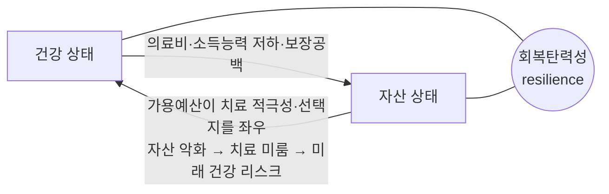

# 01 · 제품 컨텍스트 (정본 — 개념 앵커)

> 이 문서가 제품 개념의 **단일 기준(version anchor)** 이다. 다른 모든 문서는 이 정의에 정렬한다.

## 한 문장 정의

> JB WM Agent는 고객의 **건강과 자산을 분리된 두 영역이 아니라 하나의 "회복탄력성(resilience)" 상태**로 보고, 변화가 생기면(자산 변동은 선제 감지, 건강 이벤트는 고객 제출 시 재평가) **개인의 데이터로 개인화된 판단**을 내려 보험·자산·투자·의료비 대비를 **통합 제안**하고, **고객 승인 후** 실제 액션까지 연결하는 **능동형 lifelong WM 에이전트**입니다.

챗봇이 본질이 아닙니다. 본질은 **이벤트 기반 상태 그래프 + LLM 추론기**이고, 챗은 의도를 입력하는 인터페이스입니다.

## 핵심 통찰 — 건강과 자산은 하나다 (양방향)

건강과 자산은 "연결된 두 부분"이 아니라 **하나의 상태**로 봐야 합니다. 영향은 **양방향**입니다.



- **건강 → 자산/의료전략**: 의료비, 소득능력 저하, 보장 공백
- **자산 → 건강/의료전략**: 가용 예산이 *의료 선택지를 논의할 때의 재무적 여지*를 바꾼다. 자산 악화는 치료 미룸·스트레스로 이어져 *미래 건강 리스크*가 된다
- 그래서 같은 건강 이벤트라도 **자산 상태와 "의료비 감내 범위/지불 의향"에 따라 대응 시나리오가 달라진다**

→ 에이전트는 둘을 합친 **회복탄력성 상태**를 관리합니다. 이것이 진짜 **lifelong WM**입니다 — 생애 후반의 자산 수명을 결정하는 최대 변수가 의료비이기 때문입니다.

## 문제 정의

오늘날 고객은 건강·금융이 얽힌 상황에서 **모든 판단을 직접** 해야 합니다.

예시 상황:
```
- 포트폴리오 고위험 비중 70%, 최근 손실률 급등
- 3개월 뒤 대출 상환 예정 (현금흐름 압박)
- (고객 제출) 최근 건강검진 혈압 상승, 심혈관 우려
- 실손보험은 있지만 심혈관 특약 없음
- 의료에 "큰 비용은 부담스럽다"는 성향
```

기존 서비스라면 고객이 직접: 손실 대응 판단 → 상환 자금 계획 → (건강 시) 병원·비용 가늠 → 보장 확인 → 투자 조정 고민 → 상담 문의. 각 단계가 다른 시스템·전문성을 요구하고, 놓치면 **현금흐름 위기·보장 공백·부적합 투자·치료 지연**으로 이어집니다. 고령층에게 특히 부담입니다.

## 두 가지 진입 시나리오 (같은 엔진)

두 시나리오가 **동일한 상태그래프·제안·승인·실행 엔진**을 공유합니다.

### A. 자산 트리거 (선제 감지 + 고객 수동 언급)
회사 보유 데이터로 **선제 감지**되거나, 고객이 **직접 언급**(예: "다음 달 큰 지출 예정")할 수 있습니다. 둘 다 같은 흐름으로 들어갑니다.
```
포트폴리오 손실 급등 + 3개월 후 상환  → (선제 감지)
  또는  "다음 달 수술비 큰 지출 예정"   → (고객 언급, 자연어)
→ 개인 데이터로 현금흐름·의료 대비 리스크 판단
→ 개인화된 대비책 제안(비상자금·상환조정·보장 점검) → 승인 → 액션
```

### B. 건강 트리거 (객관 문서 제출 시 재평가)
건강은 고객의 *말*이 아니라 **객관 문서(진단서·정기검진 내역)** 를 제출하는 시점이 트리거입니다(의료 규제 + 주관 왜곡 방지).
```
고객이 진단서/검진 내역(객관 문서) 제출  →
→ 질병·리스크는 객관 문서 + 통계로 평가 (주관 진술로 평가하지 않음)
→ 자산 상태 + 의료비 감내 범위/지불 의향(주관)은 '대응'의 개인화에만 반영
→ 의료진과 논의할 비용 범위·질문 + 재무·보장 대비 + 통계 기반 비용 참고정보 + 전문가 연결 제안 → 승인 → 액션
```

> **객관 ↔ 주관 분리**: 같은 질병도 개인 인지·성격에 따라 진술이 달라지지만, 그 주관이 실제 질병 크기를 왜곡하면 안 됩니다. **질병 평가 = 객관 문서+통계**, **대응 개인화 = 지불의향·선호(주관)**. ([10](10_SECURITY_PRIVACY.md))

> **능동성의 비대칭**: 자산은 실시간 선제. 건강은 **온디바이스 소프트 신호**(동의 동기화 → 준선제 주의환기)와 **객관 문서 제출**(진단서·검진내역 → 평가 앵커)의 두 갈래. 소프트 신호가 "살펴볼까요?"를 띄우고, 진짜 평가는 객관 문서 + 통계가 합니다. 데모의 주된 *선제* 능동성은 자산 트리거가 현실적입니다.
>
> **자연어 입력은 1급 트리거**입니다. 고객 발화는 자산 신호("큰 지출 예정")·요청("보험 봐줘")·성향 변경("투자 보수적으로") 무엇이든 될 수 있고, **액션이 필요하면 승인 게이트를 거쳐 실행**됩니다. 성향 변경만일 때만 `PreferenceUpdate`(액션 없음)로 갑니다. ([03](03_STATE_MACHINE.md))

## 대상 사용자

| 사용자 | 역할 |
|---|---|
| **고객 (주 타깃: 고령층)** | 데이터 제공 + 제안 승인/거절 + 지불 의향 등 성향 설정. "신경 끄는" 경험 |
| 어드바이저 (부차) | 고객 회복탄력성 상태·판단 모니터링, 필요 시 개입 |
| 운영자 | 규정·통계 데이터·정책 규칙 관리 |
| 코딩 에이전트 | 문서를 따라 구현·유지보수 |

> 고령층 타깃이므로 큰 글씨·쉬운 용어·명확한 단일 승인 UX가 핵심 차별점. UI 언어 한국어 우선(i18n 구조는 ko/en 대비).

## 핵심 차별점

1. **건강·자산 통합 회복탄력성** — 단순 "건강→액션 연결"이 아니라 양방향 단일 상태로 판단.
2. **능동성** — 자산 변동을 고객 요청 없이 선제 감지·판단(기존 챗봇: 물어봐야 동작).
3. **지불 의향 기반 개인화** — "의료에 얼마 쓸 용의" 등 성향이 모든 제안을 바꾼다.
4. **이중 capability 경계** — ① AI는 실행 권한이 없다 ② AI/회사는 **의료 권고를 생성하지 않는다**(재무·통계참고·연결만). 신뢰가 아니라 구조로 안전 보장.
5. **의도 = 상태** — 잠재 의도를 상태 그래프로 구조화해 중복 실행·승인 누락·맥락 꼬임을 코드로 방지.

## 의료비 감내 범위 / 지불 의향 — 1급 개인화 변수

고객이 "의료/대응에 얼마까지 쓸 용의가 있는가", "어느 정도 부담은 심리적으로 피하고 싶은가"를 정합니다. 이것이:
- **개인화의 축**: 같은 상황도 지불 의향에 따라 다른 제안이 나온다.
- **의료조언 부담 해소 장치**: 회사는 "치료하세요"가 아니라 *"의료진과 상의할 선택지의 비용 범위를, 당신이 정한 예산·적극성 하에서 이렇게 준비할 수 있습니다"* 라고 말한다.

자산이 많다고 항상 고비용 의료 선택지를 원하는 것도 아니고, 자산이 적다고 항상 최소 비용만 원하는 것도 아닙니다. 따라서 agent는 객관 의료 사실을 바탕으로 의료 처치를 고르지 않고, **의료진과 논의할 비용 범위별 재무 시나리오**를 만듭니다.

예:
- 기본 검사/추적 관찰 중심 비용 범위
- 추가 정밀검사 포함 비용 범위
- 입원·시술 가능성까지 고려한 비용 범위

각 범위에 대해 현재 현금흐름, 보험 보장, 투자 유동화 필요성, 고객의 의료비 감내 범위를 함께 보여줍니다.

자세히는 [08_MEMORY](08_MEMORY.md), [10_SECURITY_PRIVACY](10_SECURITY_PRIVACY.md).

## 의료 경계 (중요)

금융사가 의료 처치를 권하는 것은 책임 부담입니다. 그래서 **의료 권고 자체를 생성하지 않습니다.** 회사가 제공하는 것은:
1. **재무·보장 대비** (본업)
2. **의료비 감내 범위별 대응 시나리오** (고객 자산·보험·지불의향 기준)
3. **통계 기반 참고정보** (동일 질병 평균 비용·보장 사례 — 출처 명시, [STATS_SOURCES](STATS_SOURCES.md))
4. **전문가·기관 연결** 및 의료진에게 확인할 비용·보험 질문 정리

의료 결정 권한은 항상 **고객 + 주치의**에게 있습니다. 자세히는 [10_SECURITY_PRIVACY](10_SECURITY_PRIVACY.md).

## MVP 범위

핵심 1개 플로우를 **수직으로** 완성 (모든 의도를 다 만들지 않음). 자세히는 [11_IMPLEMENTATION_ROADMAP](11_IMPLEMENTATION_ROADMAP.md).

### MVP 데모 시나리오 (자산 트리거 메인)
```
[Agent 선제 알림]
포트폴리오 손실과 3개월 후 대출 상환을 함께 분석한 결과,
의료비가 발생하면 현금흐름이 위험해질 수 있습니다.

근거 (개인 데이터 + 통계):
- 고위험 투자 비중 70%, 최근 손실
- 3개월 뒤 상환 800만원
- 65–69세 평균 대비 현금 완충 부족 (KOSIS)
- 심혈관 특약 없음 (보장 공백)

대비책 (당신의 '의료비 보수적' 성향 반영):
1. 의료진 상담 시 확인할 비용 범위·질문 리스트
2. 3개월 비상자금 확보 플랜
3. 상환 일정 조정 검토
4. 실손 보장 점검 (투자 조정은 성향상 제외)

진행할 것을 골라주세요.
```
고객이 "현금흐름이랑 보장만"이라고 하면 상태가:
```
NeedAssessment:
  cashflow_need          = high
  insurance_need         = high
  asset_defense_need     = mid
  investment_adjust_need = low/deferred (성향: 투자 보류)
```
**이것이 "고객이 고민을 분류하지 않아도 agent가 통합 필요도를 평가한다"는 의미입니다.**

## MVP 비목표

- 실제 예약/청구/거래 (전부 mock)
- 의료 권고 생성 (절대 안 함 — 재무·통계참고·연결만)
- 완전 자동 금융 자문 (항상 인간 승인)
- 다중 LLM 공급자 마이그레이션 (구조만 대비, 현재 구현은 PydanticAI reasoner 1종)
- 실시간 통계 API·벡터 RAG (나중 고도화 — 통계는 시드로 시작)

## 제품 원칙

에이전트는 **분석과 제안**을 생성한다. **코드가 상태·권한·실행을 통제**한다. 민감 액션은 **고객 승인** 뒤에만 실행되고, **의료 권고는 생성하지 않는다.**

## 평가 기준 연계 (JB 해커톤)

| 기준 | 대응 |
|---|---|
| 3.1 판단·행동·검증/개선 | Monitoring→의도추론→계획→리스크→승인→실행→검증→메모리 루프 |
| 2.4 규제·보안·내부통제 | 이중 capability 경계 + 건강/개인정보 규제 + 의료 경계 ([10](10_SECURITY_PRIVACY.md)) |
| 5.5 설명가능성·책임소재 | 액션별 승인·실행 추적, LLM 미경유 실행, 통계 출처 명시 |
| 5.1 차별성 | 건강·자산 통합 회복탄력성 + 능동성 + 지불의향 개인화 + 고령층 UX |
| 3.5 외부 데이터 출처 | 통계 공개 데이터(KOSIS·KIDI·KNHANES 등) ([STATS_SOURCES](STATS_SOURCES.md)) |
