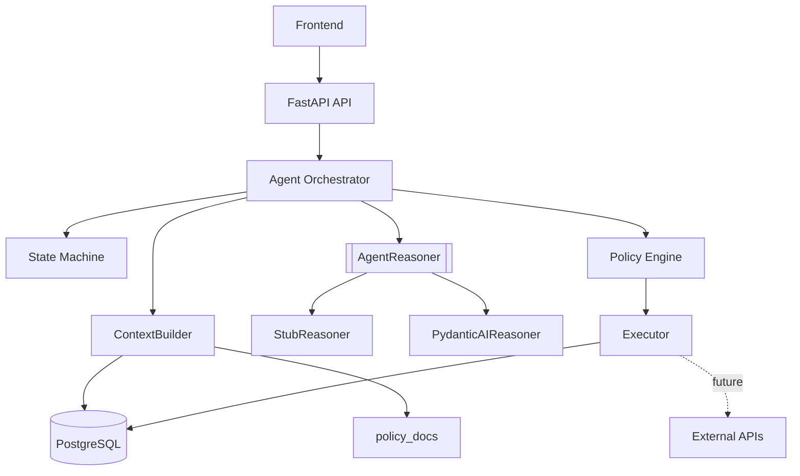

# 02 · System Architecture

JB-WM backend는 상태와 권한을 가진 애플리케이션 서버입니다. LLM은 backend가 만든 context pack을 보고 구조화 판단을 반환하는 구성요소일 뿐입니다.

## Overview

## Ownership

| Component | Owns |
|---|---|
| API | request/response, auth, customer scope |
| Orchestrator | agent loop, state transitions, records |
| FSM | allowed states |
| ContextBuilder | what data the LLM sees |
| AgentReasoner | structured judgment only |
| Policy Engine | approval routing |
| Executor | deterministic execution after approval |
| DB | customer data, memory, audit trail |

## Data Flow

1. Frontend posts a signal or user message.
2. Orchestrator records the input and moves `Monitoring -> SignalDetected -> AssessNeed`.
3. ContextBuilder reads DB/mock data and policy docs.
4. Reasoner returns `NeedAssessment`.
5. If action is needed, Reasoner returns `Plan`.
6. Policy Engine separates auto actions and approval-required actions.
7. Executor applies approved actions according to `ACTION_EXECUTION_MODE`.
8. Messages, judgments, plans, events, and proposals are stored for future context.

## Data Categories

| Category | Examples | Current access |
|---|---|---|
| Customer data | health, insurance, portfolio, loans, accounts, transactions | backend read functions |
| Statistics | age-band assets, emergency fund, risk rates | seeded DB / normalized functions |
| Policy text | internal rules, product limits, disease playbooks | `policy_docs/*.md` injected by ContextBuilder |

## Security Boundary

- LLM does not execute actions.
- LLM does not receive arbitrary DB/file access.
- Sensitive provider identifiers are removed before context injection.
- Health data without consent is not returned.
- Medical advice is forbidden; the product provides financial preparation and expert-connection support only.

## Migration Boundary

To change the LLM provider, replace `app/agent/pydantic_ai_reasoner.py`. Do not rewrite FSM, Policy Engine, Executor, DB models, or frontend API contracts unless the product behavior itself changes.
