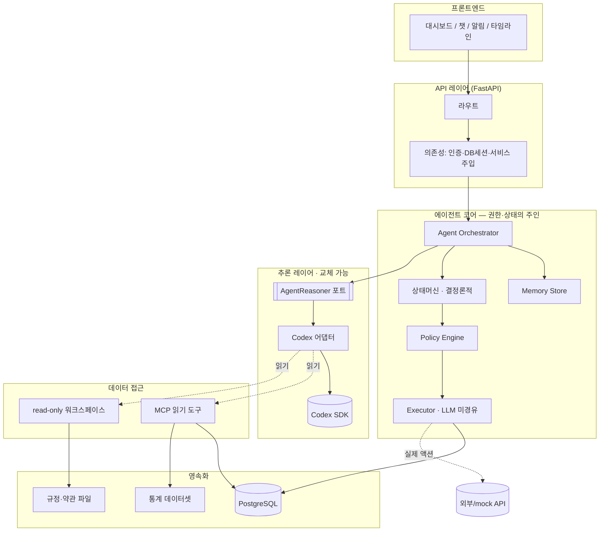
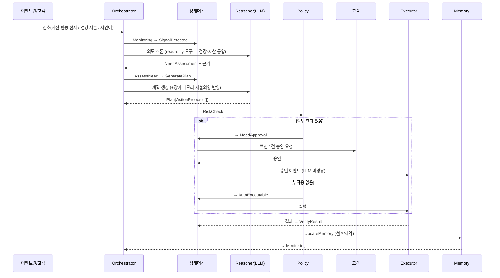
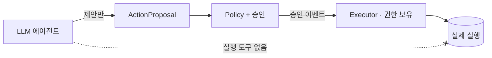

# 02 · 시스템 아키텍처

백엔드는 **결정론적 통제(상태머신·정책·실행)** 와 **비결정론적 추론(LLM)** 을 명확히 분리한 구조입니다. LLM은 판단·계획하고, 코드는 상태·권한·실행을 보장합니다.

> 제품 개념(건강·자산 통합 회복탄력성, 능동성 비대칭, 이중 capability 경계)은 [01_PRODUCT_CONTEXT](01_PRODUCT_CONTEXT.md)가 정본. 추론기는 건강·자산을 **하나의 상태로 통합 판단**하고, 진입 트리거는 **자산 변동 선제 감지(메인)** + 건강 제출 + 자연어입니다.

## 전체 구조



## 레이어별 책임

| 레이어 | 책임 |
|---|---|
| API | HTTP 라우팅, 요청 파싱, 응답 포맷, 인증 컨텍스트 |
| **Orchestrator** | 이벤트/입력 수신 → FSM 구동 → Reasoner 호출 → 결과 라우팅 |
| **상태머신 (FSM)** | 허용 상태·전이·가드. 실행 가능 여부의 단일 진실 |
| **Policy Engine** | 리스크 평가 → auto vs 고객승인 결정 |
| **Executor** | 승인된 액션의 실제 실행. **LLM을 거치지 않음** |
| **Memory Store** | 단기(진행상황) + 장기(성향·선호) |
| **AgentReasoner 포트** | 공급자 무관 추론 인터페이스 |
| **Codex 어댑터** | 포트의 Codex SDK 구현 (유일한 SDK import 지점) |
| **데이터 접근** | MCP 읽기 도구 + read-only 워크스페이스 |
| 영속화 | PostgreSQL, 규정 파일, 통계 데이터셋 |

## 런타임 흐름 (능동 루프 1회)



## 데이터 접근 3분류 (중요)

데이터를 성격별로 다르게 다룹니다. 이것이 마이그레이션·확장성·정확성을 좌우합니다.

| 분류 | 데이터 | 성격 | 접근 방식 | 출력 | MVP |
|---|---|---|---|---|---|
| **① 고객 개인** | 포트폴리오·건강·보험·대출·계좌·거래·카드 | 정형, per-customer | **MCP 읽기 도구** (`get_*`, customer_id 스코핑) | 정확한 레코드 | mock 시드 |
| **② 통계/기준** | 연령대별 자산·위험률·생명표 | 정형, 방대 | **파라미터 쿼리 도구** `get_population_stat(age_band, metric)` | 정확한 숫자 | 실제 공개 데이터 |
| **③ 비정형 텍스트** | 약관·내규·규정 | 비정형 텍스트 | **파일 읽기** (read-only 워크스페이스) | 텍스트 조각 | 파일 → 나중 RAG |

### ② 통계는 RAG가 아니다

통계는 **정형 데이터**이므로 파라미터 쿼리 API로 정확한 값을 가져옵니다. 방대한 통계를 프롬프트에 통째로 넣는 것은 낭비이고 부정확합니다. 이는 ①의 고객 도구와 **같은 tool 기반 패턴**이며, RAG(③의 비정형 텍스트 검색)와는 다릅니다.

- **실제 공개 데이터 활용 가능**: KOSIS(통계청), 가계금융복지조사, 보험개발원(KIDI) 경험생명표, KNHANES(국민건강영양조사). → 에이전트 판단이 근거를 갖게 되어 환각을 줄이고 설명가능성을 높임 (평가 3.5, 5.5).

### ③ RAG (Retrieval-Augmented Generation)

비정형 텍스트(약관 PDF, 내규)가 방대해 컨텍스트에 다 넣을 수 없을 때, 검색 인덱스에서 관련 조각만 꺼내 LLM에 주는 기법. **MVP는 파일 직접 읽기로 충분**하고, 코퍼스가 커지면 RAG로 고도화합니다.

## 이중 Capability 안전 모델

두 개의 권한 경계로 안전을 *구조적으로* 보장합니다. 자세히는 [07](07_ACTION_EXECUTION.md), [10](10_SECURITY_PRIVACY.md).

**① 실행 경계** — 에이전트에게 실행 권한을 **주지 않음**
- 에이전트의 도구 = **읽기·분석·제안만**
- Codex 샌드박스 = `read_only`, 동적 도구 = **읽기 전용 MCP**
- 실행 권한(자격증명·외부 API)은 **Executor에만** 존재
- 승인 이벤트는 LLM을 거치지 않고 Executor로 직행

**② 의료 경계** — 에이전트/회사는 **의료 권고를 생성하지 않음**
- 재무 대비 + 통계 참고정보(출처) + 전문가 연결만. 의료 결정권은 고객·주치의.



## 경계 규칙

- API 라우트는 Codex/Reasoner를 직접 호출하지 않는다 (Orchestrator 경유).
- 상태머신이 에이전트 실행/재시도/완료/실패 시점을 통제한다.
- 에이전트 도구는 좁고, 타입이 있고, 현재 고객·세션으로 스코핑된다.
- DB 접근은 도구/서비스가 소유한다. 프롬프트가 아니다.
- SDK import는 `app/agent/codex_adapter.py` 한 곳에만 존재한다.

## 배포 형태

MVP는 단일 FastAPI 프로세스로 충분합니다.

```text
FastAPI App
├── API 라우트
├── Orchestrator + 상태머신 + Policy + Executor
├── Memory
├── Codex 어댑터 (+ MCP 도구 서버)
└── PostgreSQL 연결
```

능동 모니터링(주기적 신호 감지)은 MVP에서 **스케줄러/수동 트리거 mock**으로 시작하고, 이후 이벤트 큐(Redis + RQ/Celery)로 분리합니다. 자세히는 [03](03_STATE_MACHINE.md), [11](11_IMPLEMENTATION_ROADMAP.md).
