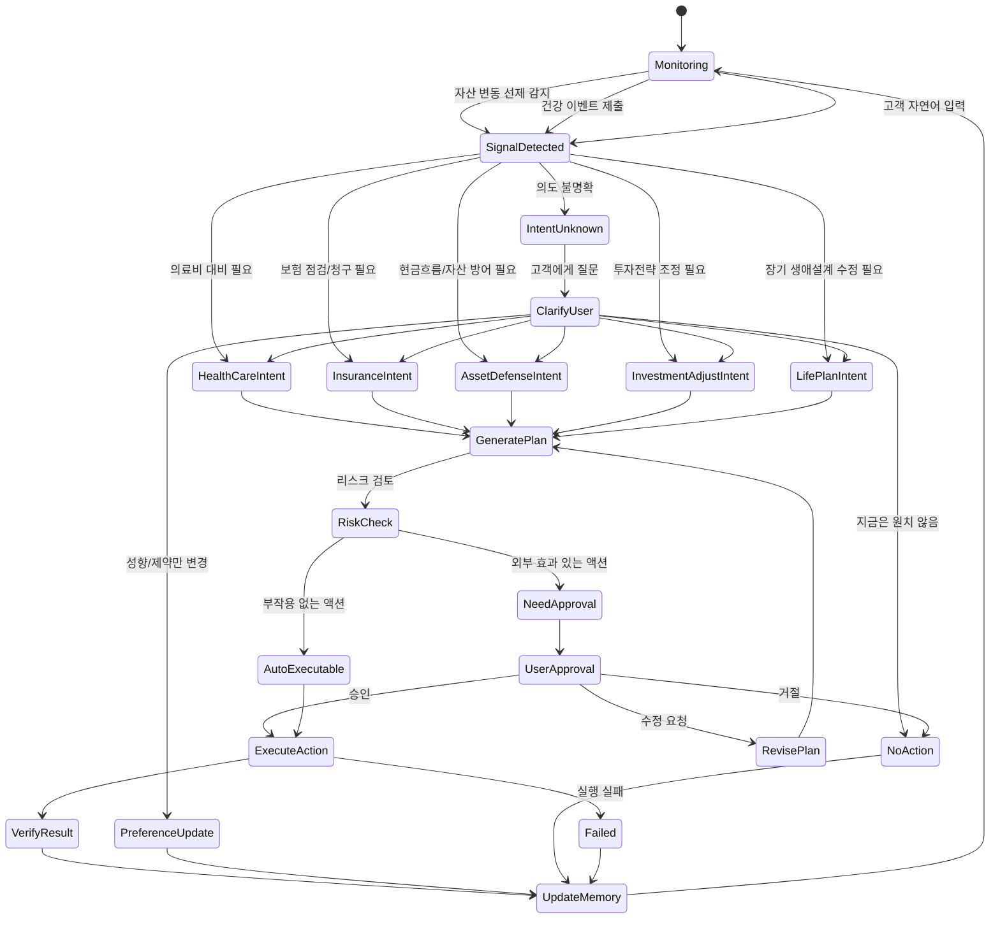

# 03 · 상태머신 (FSM)

이 문서가 서비스 로직의 **본체**입니다. LLM은 판단·계획하지만, **어떤 전이가 허용되는지는 코드가 강제**합니다. 금융/보험/의료는 결정론적 흐름이 필요하기 때문입니다.

> **Intent 상태는 도메인별 전문 에이전트가 아닙니다.** JB WM은 고객의 건강·보험·현금흐름·자산·투자·생애계획을 하나의
> 회복탄력성 상태로 보는 **통합 WM 에이전트**입니다. `InsuranceIntent`,
> `AssetDefenseIntent` 같은 상태는 하나의 통합 agent가 모든 고객 데이터를 함께 본 뒤,
> 이번 턴에서 가장 우선되는 고객 니즈와 승인 게이트를 표현하는 라벨입니다.

## 왜 상태머신인가

LLM만으로는 다음이 보장되지 않습니다:

- 중복 실행 (보험 분석 3번 실행)
- 승인 없이 실행 (포트폴리오 변경)
- 맥락 꼬임 ("그거 취소해줘" → 뭘?)
- 장기 작업 관리 (3일 뒤 다시 알림)

그래서 "현재 무엇을 하고 있고, 다음에 무엇을 할 수 있는지"를 **코드 레벨에서** 강제합니다.

## 전체 상태 그래프



## 진입 트리거 (소스별)

| 트리거 | 예시 | 처리 |
|---|---|---|
| **자산 — 시스템 선제** | 포트폴리오 손실 급등, 소비 급증, 상환 압박 (회사 보유 데이터) | **실시간 자동 감지** → `SignalDetected` (`AssetEvent`) |
| **자산 — 고객 언급** | "다음 달 큰 지출 예정이야" | 자연어 → `SignalDetected` (계획·승인으로 이어질 수 있음) |
| **건강 — 온디바이스 소프트 신호** | 동의 동기화된 혈압·수면 추세 악화 | 감지 → `SignalDetected` (`HealthEvent`, **준선제** · 주의 환기) |
| **건강 — 객관 문서 제출** | **진단서·정기검진 내역** 출력·제출 | 제출 → `SignalDetected` (`MedicalDocument`, **평가 앵커**) |
| **고객 자연어 (요청/성향)** | "내 보험 봐줘", "투자는 보수적으로" | 발화 → `SignalDetected` |

> **능동성의 비대칭**: 자산은 회사 데이터로 실시간 선제 감지가 가능하고, 건강은 고객이 객관 문서를 제출하는 시점이 트리거. 데모의 주된 *선제* 능동성은 자산 트리거. 동시에 고객 요청·언급 처리도 1급입니다.

### 자연어 입력은 1급 트리거다

자연어 입력은 다른 신호와 동일하게 `SignalDetected`로 들어가며, **결과는 발화 내용에 따라 갈립니다**:
- 액션이 필요하면(예: "큰 지출 예정" → 포트폴리오/현금흐름 조정) → `GeneratePlan → RiskCheck → 승인` (당연히 **고객 승인 필요**).
- 발화가 **순전히 성향/지불의향 변경**일 때만(예: "투자 보수적으로") → `PreferenceUpdate → UpdateMemory` (액션 없음).

즉 `PreferenceUpdate`는 자연어의 *한 갈래*일 뿐, 자연어가 성향 변경만 한다는 뜻이 아닙니다.

### 건강은 객관 문서로 앵커 (주관과 분리)

같은 질병도 개인의 인지·성격·체감에 따라 진술이 크게 달라질 수 있습니다. **그 주관이 실제 질병 크기를 왜곡하면 안 되므로**, 질병·리스크 *평가*는 **고객이 제출한 객관 문서(진단서·검진 내역) + 통계**에 앵커합니다. 주관(지불의향·선호)은 *대응의 개인화*에만 반영하고 질병 평가에는 쓰지 않습니다 ([10](10_SECURITY_PRIVACY.md)).

MVP에서 이벤트원은 **mock/수동 트리거**입니다 (예: "시뮬레이트: 포트폴리오 손실 발생", "진단서 제출" 버튼). 실제 이벤트 큐는 나중에.

## 상태 정의

모든 `*Intent` 상태에서도 agent는 특정 도메인만 보지 않습니다. 상태 이름은 주된 니즈를
표시할 뿐이며, 계획 생성은 항상 건강·보험·현금흐름·자산·투자전략·장기 메모리를 함께
검토해야 합니다.

| 상태 | 고객의 숨은 의도 | 에이전트 판단 | 가능한 액션 |
|---|---|---|---|
| `Monitoring` | (없음) | 데이터 지속 관찰, 이상 징후 탐지 | 동기화, 신호 탐지 |
| `SignalDetected` | "뭔가 관리 필요할 수도" | 이벤트 분류 | 의도 분류 |
| `IntentUnknown` | 불명확 | 어느 영역 문제인지 모름 | 질문 |
| `HealthCareIntent` | "의료비를 어떻게 대비하지?" | 지불의향·자산 고려한 **재무 대비** (의료 권고 아님) | 비용 대비 플랜, 통계 참고정보, 전문가 연결 제안 |
| `InsuranceIntent` | "내 보험으로 커버되나?" | 보장 범위 ↔ 건강 이벤트 매칭 | 보장 분석, 청구 가능성 안내 |
| `AssetDefenseIntent` | "당장 현금흐름 괜찮나?" | 의료비/소득/대출 리스크 계산 | 비상자금, 지출/상환 조정 |
| `InvestmentAdjustIntent` | "위험도 낮춰야 하나?" | 건강/나이/자산 변동에 따른 재평가 | 리밸런싱 제안 |
| `LifePlanIntent` | "장기 계획 바꿔야 하나?" | 은퇴/보험/자산배분 영향 분석 | 장기 재무계획 업데이트 |
| `GeneratePlan` | — | 의도 충족 액션 계획 (장기 메모리 반영) | Plan(ActionProposal[]) 생성 |
| `RiskCheck` | — | 의료/금융/법적 리스크 평가 | Policy Engine 라우팅 |
| `AutoExecutable` | — | 부작용 없음 확인 | 즉시 실행 가능 |
| `NeedApproval` | "이건 내가 승인해야" | 외부 효과 액션 감지 | 승인 요청 |
| `UserApproval` | — | 고객 응답 대기 | 승인/수정/거절 |
| `RevisePlan` | — | 수정 요청 반영 | 재계획 |
| `ExecuteAction` | "대신 처리해줘" | (Executor가) 실제 수행 | 예약·신청·알림 |
| `VerifyResult` | "진짜 됐나?" | 결과 확인 | 완료/실패 판정 |
| `PreferenceUpdate` | "다음부턴 반영해줘" | 성향/제약 변경만 | 장기 메모리 갱신 |
| `UpdateMemory` | — | 단기/장기 메모리 반영 | 선호·진행상황 저장 |
| `NoAction` | — | 액션 안 함 | 보류/거절 기록 |
| `Failed` | — | 실행 실패 | 사유 기록, 메모리 반영 |

## 전이 규칙 (요약)

LLM이 관여하는 핵심 지점은 상태머신 전체가 아니라, **상태 전이를 위한 판단 입력**입니다.
구체적으로 LLM은 `SignalDetected`에서 intent를 추론하고, `GeneratePlan`에서
구조화된 `Plan(ActionProposal[])`을 생성합니다. 코드가 그 결과를 검증해 실제 전이를
적용합니다.

| From | To | 트리거 | 소유 |
|---|---|---|---|
| Monitoring | SignalDetected | 이벤트 또는 자연어 입력 | Orchestrator |
| SignalDetected | *Intent / IntentUnknown | LLM 의도 추론 결과 | 코드(분기) + LLM(분류) |
| IntentUnknown | ClarifyUser | 질문 필요 | Orchestrator |
| *Intent | GeneratePlan | 의도 확정 | 상태머신 |
| GeneratePlan | RiskCheck | 계획 생성 완료 | 상태머신 |
| RiskCheck | AutoExecutable / NeedApproval | **Policy Engine 판정** | 코드 |
| NeedApproval | UserApproval | 승인 요청 발송 | 상태머신 |
| UserApproval | ExecuteAction / RevisePlan / NoAction | **고객 응답** | 고객 |
| AutoExecutable | ExecuteAction | 자동 | 상태머신 |
| ExecuteAction | VerifyResult / Failed | **Executor 실행 결과** | Executor |
| VerifyResult / NoAction / PreferenceUpdate / Failed | UpdateMemory | — | 상태머신 |
| UpdateMemory | Monitoring | 루프 종료 | 상태머신 |

### LLM 관여 지점

| 단계 | LLM 역할 | 코드 역할 |
|---|---|---|
| `SignalDetected` | 고객 신호와 최신 컨텍스트를 보고 `IntentInference` 생성 | 허용된 intent인지 검증하고 해당 상태로 전이 |
| `IntentUnknown` | 명확화 질문 초안 생성 | `ClarifyUser` 상태로 전이하고 질문을 고객에게 노출 |
| `GeneratePlan` | 통합 컨텍스트와 메모리를 바탕으로 `Plan(ActionProposal[])` 생성 | 제안을 DB에 저장하고 `RiskCheck`로 전이 |
| `RevisePlan` | 고객 수정 요청을 반영해 계획 재생성 | 기존 proposal 상태 변경, 새 proposal 저장 |
| `UpdateMemory` 일부 | 발화에서 선호·제약·지불의향 후보 추출 | 실제 장기 메모리 반영 여부를 정책/검증 후 저장 |

LLM은 `RiskCheck`, `NeedApproval`, `UserApproval`, `ExecuteAction`, `VerifyResult`의
권한을 갖지 않습니다. 이 단계들은 Policy Engine, 고객, Executor가 소유합니다.

## 가드 조건

- 유효한 고객 컨텍스트 없이는 의도 추론을 시작할 수 없다.
- `NeedApproval` 액션은 명시적 고객 승인 없이 `ExecuteAction`으로 갈 수 없다.
- `ExecuteAction`은 Executor만 트리거한다. LLM 출력으로 직접 실행하지 않는다.
- 승인은 **해당 ActionProposal 1건에만** 유효하다 (전권 위임 불가).
- 완료/실패 세션은 명시적 관리 작업 외에 수정 불가.

## 병렬 의도 (확장)

실제로는 여러 의도가 동시에 활성일 수 있습니다 (보험 진행 중 + 투자 보류). 이는 여러
전문 agent를 둔다는 뜻이 아니라, 하나의 통합 agent 안에서 여러 니즈의 처리 상태를
동시에 추적한다는 뜻입니다. MVP는 단일 주 의도 흐름으로 시작하고, 의도별 서브상태
(`ACTIVE` / `DEFERRED` / `PENDING` / `APPROVED`)를 두는 계층적 상태머신으로 확장합니다.

```
InsuranceIntent     = ACTIVE
AssetDefenseIntent  = ACTIVE
InvestmentAdjustIntent = DEFERRED
HealthCareIntent    = PENDING
```

## 영속화 필드 (세션)

`AnalysisSession`/`AgentSession` 테이블 권장 필드는 [05_DATA_MODEL.md](05_DATA_MODEL.md) 참고. 핵심: `id`, `customer_id`, `state`, `active_intents`, `agent_thread_id`, `pending_proposal_id`, `created_at`, `updated_at`.

## 프론트엔드 계약

프론트는 상태를 렌더링하고 고객 행동을 제출합니다. 유효 전이를 독자적으로 추론하지 않습니다. 백엔드 응답에 포함:

- 현재 상태 + 활성 의도
- 허용된 다음 행동 (승인/수정/거절 등)
- 대기 중 ActionProposal (있으면)
- 실패 상세 (있으면)
