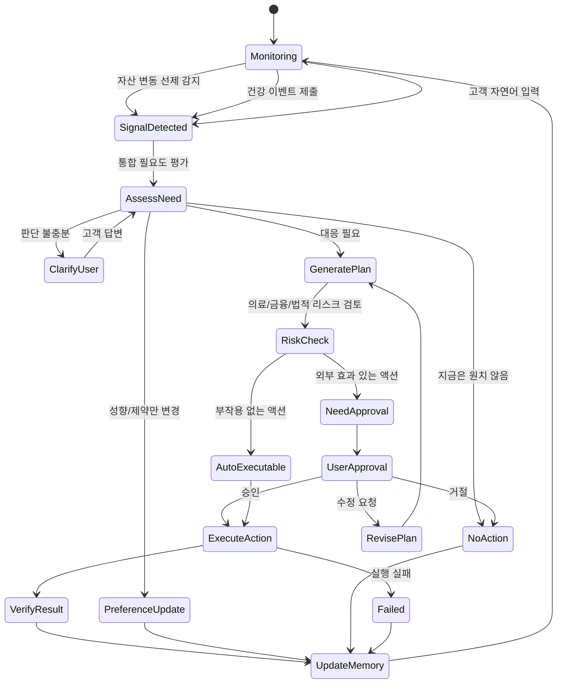

# 03 · 상태머신 (FSM)

이 문서가 서비스 로직의 **본체**입니다. LLM은 통합 필요도 평가와 계획 생성을 하지만,
**어떤 전이가 허용되는지는 코드가 강제**합니다. 금융/보험/의료는 결정론적 흐름이
필요하기 때문입니다.

JB WM은 고객의 건강·보험·현금흐름·자산·투자·생애계획을 하나의 회복탄력성 상태로 보는
**통합 WM 에이전트**입니다. 신호를 `InsuranceIntent` 같은 단일 의도로 좁히지 않고,
`AssessNeed`에서 여러 필요도를 함께 평가합니다.

## 왜 상태머신인가

LLM만으로는 다음이 보장되지 않습니다:

- 중복 실행 (보험 분석 3번 실행)
- 승인 없이 실행 (포트폴리오 변경)
- 맥락 꼬임 ("그거 취소해줘" → 뭘?)
- 장기 작업 관리 (3일 뒤 다시 알림)

그래서 "현재 무엇을 하고 있고, 다음에 무엇을 할 수 있는지"를 **코드 레벨에서** 강제합니다.

## 전체 상태 그래프



## 진입 트리거 (소스별)

| 트리거 | 예시 | 처리 |
|---|---|---|
| **자산 — 시스템 선제** | 포트폴리오 손실 급등, 소비 급증, 상환 압박 | `SignalDetected → AssessNeed` |
| **자산 — 고객 언급** | "다음 달 큰 지출 예정이야" | 자연어 → 통합 필요도 평가 |
| **건강 — 온디바이스 소프트 신호** | 동의 동기화된 혈압·수면 추세 악화 | 주의 환기 → 통합 필요도 평가 |
| **건강 — 객관 문서 제출** | 진단서·정기검진 내역 | 제출 → 통계/보험/자산과 함께 평가 |
| **고객 자연어 (요청/성향)** | "보험 봐줘", "투자는 보수적으로" | 직접 요청 또는 성향 변경으로 평가 |

자연어 입력은 다른 신호와 동일하게 `SignalDetected`로 들어가며, `AssessNeed`에서 발화 내용과
고객 컨텍스트를 함께 평가합니다. 고객이 직접 요청한 수동 입력은 해당 필요도를 강하게 반영합니다.
예를 들어 "보험 봐줘"는 `insurance_need=high`로 평가합니다. 다만 요청이 모호하거나 고객이
본인 문제를 잘못 분류한 것으로 보이면 `ClarifyUser`에서 질문하거나 다른 필요도를 함께 표시합니다.

건강은 객관 문서로 앵커합니다. 질병·리스크 평가는 고객이 제출한 객관 문서(진단서·검진 내역)와
통계에 앵커하고, 주관(지불의향·선호)은 대응 개인화에만 반영합니다.

## AssessNeed

`AssessNeed`는 단일 intent를 선택하지 않고 아래 필요도를 각각 `none/low/mid/high`로 평가합니다.

```json
{
  "medical_cost_need": "mid",
  "insurance_need": "high",
  "cashflow_need": "high",
  "asset_defense_need": "mid",
  "investment_adjust_need": "low",
  "life_plan_need": "none",
  "primary_need": "cashflow"
}
```

필드 의미:

| 필드 | 의미 |
|---|---|
| `medical_cost_need` | 의료비 감내 범위 설계 필요성. 의료 권고가 아니라 비용 범위별 재무 시나리오 |
| `insurance_need` | 보장 공백/청구 가능성/보험료 부담 점검 필요성 |
| `cashflow_need` | 단기 지불능력. 의료비·상환·카드청구·생활비를 감당할 수 있는가 |
| `asset_defense_need` | 보유자산 훼손 방어. 손실 확정 매도, 고위험 비중, 장기 자산 안정성 |
| `investment_adjust_need` | 위 평가 결과를 종합한 투자전략 조정 필요성 |
| `life_plan_need` | 은퇴·생활비·장기 목표·생애설계 재검토 필요성 |
| `primary_need` | UI/설명용 주 관심축. FSM 상태가 아니라 평가 결과의 요약 |

현금흐름과 자산방어는 분리합니다. 현금흐름은 단기 지불능력이고, 자산방어는 보유자산 훼손을
막는 문제입니다. 두 축은 연결되지만 같은 값으로 합치지 않습니다.

## 상태 정의

| 상태 | 의미 | 소유 |
|---|---|---|
| `Monitoring` | 기본 대기/관찰 상태 | Orchestrator |
| `SignalDetected` | 이벤트 또는 자연어 입력 수신 | Orchestrator |
| `AssessNeed` | 통합 필요도 평가 (`NeedAssessment`) | LLM + 코드 검증 |
| `ClarifyUser` | 평가에 필요한 질문 대기 | Orchestrator |
| `GeneratePlan` | 필요도와 메모리를 바탕으로 `Plan(ActionProposal[])` 생성 | LLM + 코드 저장 |
| `RiskCheck` | 의료/금융/법적 리스크 평가 | Policy Engine |
| `AutoExecutable` | 부작용 없는 액션 | FSM |
| `NeedApproval` | 외부 효과 있는 액션 발견 | FSM |
| `UserApproval` | 고객 승인/수정/거절 대기 | 고객 |
| `RevisePlan` | 고객 수정 요청 반영 | Orchestrator + LLM |
| `ExecuteAction` | 승인/자동 액션 실제 실행 | Executor |
| `VerifyResult` | 실행 결과 검증 | Executor/FSM |
| `PreferenceUpdate` | 성향/제약만 변경 | Orchestrator |
| `UpdateMemory` | 단기/장기 메모리 반영 | Orchestrator |
| `NoAction` | 액션 없음/거절/보류 | Orchestrator |
| `Failed` | 실행 실패 | Executor/FSM |

## 전이 규칙 (요약)

| From | To | 트리거 | 소유 |
|---|---|---|---|
| Monitoring | SignalDetected | 이벤트 또는 자연어 입력 | Orchestrator |
| SignalDetected | AssessNeed | 신호 수신 완료 | Orchestrator |
| AssessNeed | ClarifyUser / PreferenceUpdate / NoAction / GeneratePlan | `NeedAssessment` 결과 | 코드(분기) + LLM(평가) |
| ClarifyUser | AssessNeed / PreferenceUpdate / NoAction | 고객 답변 | Orchestrator |
| GeneratePlan | RiskCheck | 계획 생성 완료 | 상태머신 |
| RiskCheck | AutoExecutable / NeedApproval | Policy Engine 판정 | 코드 |
| NeedApproval | UserApproval | 승인 요청 발송 | 상태머신 |
| UserApproval | ExecuteAction / RevisePlan / NoAction | 고객 응답 | 고객 |
| RevisePlan | GeneratePlan | 수정 요청 반영 | Orchestrator |
| AutoExecutable | ExecuteAction | 자동 | 상태머신 |
| ExecuteAction | VerifyResult / Failed | Executor 실행 결과 | Executor |
| VerifyResult / NoAction / PreferenceUpdate / Failed | UpdateMemory | — | 상태머신 |
| UpdateMemory | Monitoring | 루프 종료 | 상태머신 |

## LLM 관여 지점

| 단계 | LLM 역할 | 코드 역할 |
|---|---|---|
| `AssessNeed` | 고객 신호와 최신 컨텍스트를 보고 `NeedAssessment` 생성 | 명확화/성향변경/계획생성 중 하나로 분기 |
| `ClarifyUser` | 명확화 질문 초안 생성 | 질문을 고객에게 노출하고 답변을 다음 평가에 반영 |
| `GeneratePlan` | `NeedAssessment`와 통합 컨텍스트/메모리를 바탕으로 `Plan(ActionProposal[])` 생성 | 제안을 DB에 저장하고 `RiskCheck`로 전이 |
| `RevisePlan` | 고객 수정 요청을 반영해 계획 재생성 | 기존 proposal 상태 변경, 새 proposal 저장 |
| `UpdateMemory` 일부 | 발화에서 선호·제약·지불의향 후보 추출 | 실제 장기 메모리 반영 여부를 정책/검증 후 저장 |

LLM은 `RiskCheck`, `NeedApproval`, `UserApproval`, `ExecuteAction`, `VerifyResult`의 권한을 갖지 않습니다.
이 단계들은 Policy Engine, 고객, Executor가 소유합니다.

## 가드 조건

- 유효한 고객 컨텍스트 없이는 필요도 평가를 시작할 수 없다.
- `NeedApproval` 액션은 명시적 고객 승인 없이 `ExecuteAction`으로 갈 수 없다.
- `ExecuteAction`은 Executor만 트리거한다. LLM 출력으로 직접 실행하지 않는다.
- 승인은 해당 ActionProposal 1건에만 유효하다 (전권 위임 불가).
- 완료/실패 세션은 명시적 관리 작업 외에 수정 불가.

## 병렬 필요도 (확장)

실제로는 여러 필요도가 동시에 높을 수 있습니다. 이는 여러 전문 agent를 둔다는 뜻이 아니라,
하나의 통합 agent 안에서 여러 니즈의 처리 상태를 동시에 추적한다는 뜻입니다. MVP는
`NeedAssessment`의 필요도 값과 `active_needs` JSON으로 시작하고, 필요 시 필요도별
서브상태(`ACTIVE` / `DEFERRED` / `PENDING` / `APPROVED`)로 확장합니다.

```
insurance_need         = ACTIVE
cashflow_need          = ACTIVE
asset_defense_need     = ACTIVE
investment_adjust_need = DEFERRED
```

## 영속화 필드 (세션)

`AgentSession` 핵심 필드: `id`, `customer_id`, `state`, `active_needs`,
`agent_thread_id`, `pending_proposal_id`, `recent_context`, `created_at`, `updated_at`.

`active_needs`는 `primary_need`와 각 need level을 담는 JSON입니다. FSM 상태가 아니라
`AssessNeed` 결과의 세션 스냅샷입니다.

## 프론트엔드 계약

프론트는 상태를 렌더링하고 고객 행동을 제출합니다. 유효 전이를 독자적으로 추론하지 않습니다.
백엔드 응답에 포함:

- 현재 상태 + 활성 필요도
- 허용된 다음 행동 (승인/수정/거절 등)
- 대기 중 ActionProposal (있으면)
- 실패 상세 (있으면)
