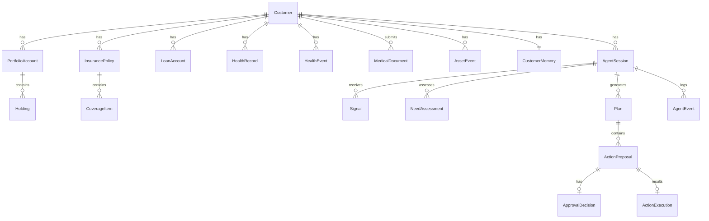

# 05 · 데이터 모델

SQLModel 기반 PostgreSQL 모델입니다. MVP 핵심 엔티티를 정의하고, 변경 시 이 문서를 갱신합니다.

## 엔티티 개요

## 고객 & 도메인 데이터 (분류 ①)

### Customer
| 필드 | 타입 | 설명 |
|---|---|---|
| id | uuid | PK |
| name | str | 이름 |
| birth_date | date | 생년월일 (연령대 산출) |
| age_band | str | 파생: `60-64`,`65-69`… (통계 조회 키) |
| locale | str | `ko` / `en` |
| created_at, updated_at | datetime | |

### HealthRecord (정적 건강 데이터)
| 필드 | 타입 | 설명 |
|---|---|---|
| id | uuid | PK |
| customer_id | uuid | FK |
| source | str | `checkup` / `device` / `self_reported` |
| metric | str | `blood_pressure`,`sleep_score`,`bmi`… |
| value | json | 측정값 |
| measured_at | datetime | |
| consent_id | uuid | 동의 근거 ([10](10_SECURITY_PRIVACY.md)) |

### HealthEvent (감지된 건강 신호)
| 필드 | 타입 | 설명 |
|---|---|---|
| id | uuid | PK |
| customer_id | uuid | FK |
| kind | str | `bp_rising`,`sleep_decline`,`med_cost_spike` |
| severity | str | `low`/`mid`/`high` |
| detected_at | datetime | |
| raw_ref | json | 근거 데이터 참조 |

### MedicalDocument (고객 제출 객관 문서) ★
질병·리스크 *평가의 앵커*. 고객의 주관 진술이 아니라 **진단서·정기검진 내역** 같은 객관 문서로 판단합니다 ([01](01_PRODUCT_CONTEXT.md), [10](10_SECURITY_PRIVACY.md)).
| 필드 | 타입 | 설명 |
|---|---|---|
| id | uuid | PK |
| customer_id | uuid | FK |
| doc_type | str | `diagnosis`(진단서) / `checkup`(검진내역) / `prescription`(처방) |
| issued_at | date | 발급일 |
| summary | json | 구조화 요약 (질병코드·수치 등) |
| file_ref | str | 원본 파일 참조 |
| consent_id | uuid | 동의 근거 |

> 주관(인지·성격·지불의향)은 `CustomerMemory`에, **객관 의료 사실은 `MedicalDocument`/`HealthRecord`에** 분리 저장. 질병 평가는 객관 데이터 + 통계, 대응 개인화는 주관.

### PortfolioAccount / Holding
| Holding 필드 | 타입 | 설명 |
|---|---|---|
| id | uuid | PK |
| account_id | uuid | FK |
| asset_type | str | `equity`,`bond`,`cash`,`fund` |
| risk_grade | str | `low`/`mid`/`high` |
| amount | decimal | 평가금액 |
| weight | float | 비중 |

### InsurancePolicy / CoverageItem
| CoverageItem 필드 | 타입 | 설명 |
|---|---|---|
| id | uuid | PK |
| policy_id | uuid | FK |
| coverage_type | str | `실손`,`암`,`심혈관특약`… |
| limit_amount | decimal | 보장 한도 |
| active | bool | 유효 여부 |

### LoanAccount
| 필드 | 타입 | 설명 |
|---|---|---|
| id | uuid | PK |
| customer_id | uuid | FK |
| principal | decimal | 원금 |
| balance | decimal | 잔액 |
| next_due_date | date | 다음 상환일 (현금흐름 리스크) |
| monthly_payment | decimal | 월 상환액 |

### AssetEvent (감지된 자산 신호 — 선제 트리거)
건강과 대칭. 회사 보유 데이터로 **실시간 감지**되는 자산 변동이 능동성의 메인 트리거입니다 ([01](01_PRODUCT_CONTEXT.md), [03](03_STATE_MACHINE.md)).
| 필드 | 타입 | 설명 |
|---|---|---|
| id | uuid | PK |
| customer_id | uuid | FK |
| kind | str | `spending_spike`,`portfolio_loss`,`income_drop`,`repayment_pressure` |
| severity | str | `low`/`mid`/`high` |
| detected_at | datetime | |
| raw_ref | json | 근거 데이터 참조 |

> 건강 이벤트는 고객 제출(`source=self_reported`/진단), 자산 이벤트는 회사 보유 데이터 자동 감지. 둘 다 `SignalDetected`로 들어가 통합 회복탄력성 판단의 입력이 됩니다.

> ① 데이터는 **MCP 읽기 도구**로만 에이전트에 노출됩니다. 직접 prompt 주입 금지. 어댑터 외부에서 접근 시 도구를 거칩니다.

## 메모리 & 개인화 ([08](08_MEMORY.md))

### CustomerMemory (장기)
| 필드 | 타입 | 설명 |
|---|---|---|
| customer_id | uuid | PK/FK |
| **medical_willingness** | str | **지불의향** `conservative`/`moderate`/`aggressive` — 1급 개인화 변수 ([08](08_MEMORY.md)) |
| medical_one_time_budget_krw | decimal | 고객이 감내 가능한 일회성 의료비 부담 한도 |
| monthly_medical_budget_krw | decimal | 고객이 감내 가능한 월 의료비/건강 관련 지출 한도 |
| medical_budget_ratio | float | 월 현금흐름 대비 의료비 부담 허용 비율 |
| risk_preference | str | `low`/`mid`/`high` |
| hospital_preference | str | 예: "전북대학교병원" |
| investment_style | str | `stable`/`balanced`/`aggressive` |
| constraints | json | 예: `{"투자": "보류"}` |
| updated_at | datetime | |

### AgentSession (단기 + 상태)
| 필드 | 타입 | 설명 |
|---|---|---|
| id | uuid | PK |
| customer_id | uuid | FK |
| state | str | 현재 FSM 상태 ([03](03_STATE_MACHINE.md)) |
| active_needs | json | `primary_need`와 필요도별 level |
| agent_thread_id | str | 추론 세션 참조 (어댑터 해석) |
| pending_proposal_id | uuid | 승인 대기 중 ActionProposal |
| recent_context | json | 최근 대화/진행상황 (단기) |
| created_at, updated_at | datetime | |

## 에이전트 워크플로우 데이터

### Signal
| 필드 | 타입 | 설명 |
|---|---|---|
| id | uuid | PK |
| session_id | uuid | FK |
| source | str | `event` / `user_utterance` |
| payload | json | 이벤트 데이터 또는 발화 |
| created_at | datetime | |

### AgentMessage

고객 발화, 시스템 신호, assistant 요약을 append-only로 저장합니다.
`AgentEvent`는 UI 타임라인이고, `AgentMessage`는 compact와 무관한 전문/감사용 기록입니다.

| 필드 | 타입 | 설명 |
|---|---|---|
| id | uuid | PK |
| session_id | uuid | FK |
| role | str | `user` / `system` / `assistant` / `tool` |
| content | str | 원문 또는 요약 |
| metadata | json | source, payload, proposal ids 등 |
| created_at | datetime | |

### NeedAssessmentRecord

`AssessNeed`의 구조화 결과를 저장합니다.

| 필드 | 타입 | 설명 |
|---|---|---|
| id | uuid | PK |
| session_id | uuid | FK |
| needs | json | 6개 need level |
| primary_need | str | UI/설명용 주 관심축 |
| confidence | float | |
| rationale | str | 근거 (설명가능성) |
| raw_output | json | 전체 구조화 출력 |
| created_at | datetime | |

### PlanRecord / ActionProposal
| PlanRecord 필드 | 타입 | 설명 |
|---|---|---|
| id | uuid | PK |
| session_id | uuid | FK |
| explanation | str | 계획 설명 |
| raw_output | json | 전체 구조화 출력 |
| proposal_ids | json | 생성된 ActionProposal id 목록 |
| created_at | datetime | |

| ActionProposal 필드 | 타입 | 설명 |
|---|---|---|
| id | uuid | PK |
| session_id | uuid | FK |
| kind | str | `book_hospital`,`review_insurance`… |
| summary | str | 고객에게 보일 요약 |
| has_external_effect | bool | **Policy 라우팅 입력** |
| params | json | 실행 파라미터 |
| status | str | `proposed`/`approved`/`rejected`/`deferred`/`executed`/`failed` |

### ApprovalDecision
| 필드 | 타입 | 설명 |
|---|---|---|
| id | uuid | PK |
| proposal_id | uuid | FK (1건 스코핑) |
| decision | str | `approve`/`reject`/`revise` |
| decided_by | uuid | 고객 id |
| decided_at | datetime | |
| note | str | 수정 요청 내용 등 |

### ActionExecution
| 필드 | 타입 | 설명 |
|---|---|---|
| id | uuid | PK |
| proposal_id | uuid | FK |
| executor | str | 실행 핸들러 종류 |
| status | str | `success`/`failed` |
| result | json | 외부 API 응답 (mock 포함) |
| executed_at | datetime | |

> `ActionExecution`은 **Executor만** 생성합니다 ([07](07_ACTION_EXECUTION.md)). LLM/도구가 만들지 않습니다.

### AgentEvent (감사 로그)
| 필드 | 타입 | 설명 |
|---|---|---|
| id | uuid | PK |
| session_id | uuid | FK |
| type | str | 상태전이/도구호출/실행/승인 |
| detail | json | |
| created_at | datetime | |

## 통계/기준 데이터 (분류 ②)

per-customer가 아니라 참조 데이터입니다. 별도 테이블 또는 읽기 전용 데이터셋으로 두고 **파라미터 쿼리 도구**로 조회합니다 ([06](06_TOOL_CONTRACTS.md)).

### PopulationStat (예시)
| 필드 | 타입 | 설명 |
|---|---|---|
| age_band | str | `65-69` |
| metric | str | `avg_assets`,`mortality_rate`,`cardio_risk` |
| value | json | 값 |
| source | str | 출처 (KOSIS/KIDI/KNHANES…) |

## 비정형 규정 (분류 ③)

DB가 아니라 파일로 둡니다 (read-only 워크스페이스). 메타데이터만 DB에 둘 수 있습니다. RAG는 나중 ([02](02_SYSTEM_ARCHITECTURE.md) 참고).

## 건강 데이터 3계층 (역할 분리)

온디바이스 API(HealthKit·삼성헬스)는 사라지지 않았습니다 — `HealthRecord`의 한 소스이며, **"제3자 자동수집"이 아니라 "고객이 동의한 본인 데이터 동기화"**라 규제상 허용됩니다. 계층별 역할:

| 계층 | 엔티티 | 출처 | 역할 |
|---|---|---|---|
| 원시 측정 | `HealthRecord` (`source=device/checkup/self_reported`) | 온디바이스 동기화·검진 수치·직접 입력 | 측정값 보관 |
| 소프트 신호 | `HealthEvent` (`bp_rising`,`sleep_decline`) | 측정에서 감지 | **주의 환기·트리거** (질병 확정 평가 아님) |
| 객관 확정 문서 | `MedicalDocument` (진단서·검진내역) | 고객 제출 | **질병·리스크 평가의 앵커** |

→ 소프트 신호는 "살펴볼까요?"를 띄우고, 진짜 평가는 객관 문서 + 통계가 합니다. 주관(인지·지불의향)은 평가가 아닌 *대응 개인화*에만 ([10](10_SECURITY_PRIVACY.md)).

## 데이터 영속성 & 보유

고객 프로필은 가입 시점에서 끝나지 않고 **누적**됩니다. 세 가지 성격:

| 성격 | 대상 | 저장 방식 |
|---|---|---|
| **현재 상태** | Customer·Portfolio·Insurance·Loan·`CustomerMemory` 값 | 최신값 유지(갱신) + 변동 이력 |
| **이력 (append-only)** | `Signal`·`HealthEvent`/`AssetEvent`·`MedicalDocument`·`Plan`·`ActionProposal`·`ActionExecution`·`AgentEvent` | 지우지 않음 → 감사·설명가능성 |
| **개인화 (누적·진화)** | `CustomerMemory` (지불의향·성향·선호·제약) | 세션을 넘어 영속·학습 |

이력(append-only)이 "왜 이 제안을 했는가"를 사후 추적 가능하게 하고, `CustomerMemory`의 영속이 "장기 에이전트"를 만듭니다.

> **보유·파기 (규제)**: 영속은 **동의 범위·보유기간 내**에서만입니다. 개인정보보호법상 보유기간 만료·**동의 철회(잊힐 권리)** 시 파기해야 하며, 건강은 민감정보라 더 엄격합니다. MVP는 저장만 구현하되 이 원칙을 따릅니다 ([10](10_SECURITY_PRIVACY.md)).
