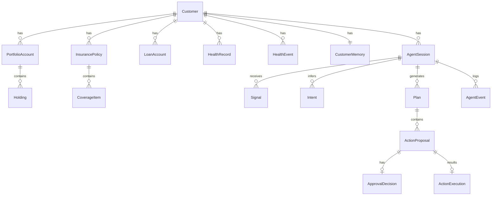

# 05 · 데이터 모델

SQLModel 기반 PostgreSQL 모델입니다. MVP 핵심 엔티티를 정의하고, 변경 시 이 문서를 갱신합니다.

## 엔티티 개요

## 고객 & 도메인 데이터 (분류 ①)

### Customer
| 필드 | 타입 | 설명 |
|---|---|---|
| id | uuid | PK |
| name | str | 이름 |
| birth_date | date | 생년월일 (연령대 산출) |
| age_band | str | 파생: `60-64`,`65-69`… (통계 조회 키) |
| locale | str | `ko` / `en` |
| created_at, updated_at | datetime | |

### HealthRecord (정적 건강 데이터)
| 필드 | 타입 | 설명 |
|---|---|---|
| id | uuid | PK |
| customer_id | uuid | FK |
| source | str | `checkup` / `device` / `self_reported` |
| metric | str | `blood_pressure`,`sleep_score`,`bmi`… |
| value | json | 측정값 |
| measured_at | datetime | |
| consent_id | uuid | 동의 근거 ([10](10_SECURITY_PRIVACY.md)) |

### HealthEvent (감지된 건강 신호)
| 필드 | 타입 | 설명 |
|---|---|---|
| id | uuid | PK |
| customer_id | uuid | FK |
| kind | str | `bp_rising`,`sleep_decline`,`med_cost_spike` |
| severity | str | `low`/`mid`/`high` |
| detected_at | datetime | |
| raw_ref | json | 근거 데이터 참조 |

### PortfolioAccount / Holding
| Holding 필드 | 타입 | 설명 |
|---|---|---|
| id | uuid | PK |
| account_id | uuid | FK |
| asset_type | str | `equity`,`bond`,`cash`,`fund` |
| risk_grade | str | `low`/`mid`/`high` |
| amount | decimal | 평가금액 |
| weight | float | 비중 |

### InsurancePolicy / CoverageItem
| CoverageItem 필드 | 타입 | 설명 |
|---|---|---|
| id | uuid | PK |
| policy_id | uuid | FK |
| coverage_type | str | `실손`,`암`,`심혈관특약`… |
| limit_amount | decimal | 보장 한도 |
| active | bool | 유효 여부 |

### LoanAccount
| 필드 | 타입 | 설명 |
|---|---|---|
| id | uuid | PK |
| customer_id | uuid | FK |
| principal | decimal | 원금 |
| balance | decimal | 잔액 |
| next_due_date | date | 다음 상환일 (현금흐름 리스크) |
| monthly_payment | decimal | 월 상환액 |

> ① 데이터는 **MCP 읽기 도구**로만 에이전트에 노출됩니다. 직접 prompt 주입 금지. 어댑터 외부에서 접근 시 도구를 거칩니다.

## 메모리 & 개인화 ([08](08_MEMORY.md))

### CustomerMemory (장기)
| 필드 | 타입 | 설명 |
|---|---|---|
| customer_id | uuid | PK/FK |
| risk_preference | str | `low`/`mid`/`high` |
| hospital_preference | str | 예: "서울아산병원" |
| investment_style | str | `stable`/`balanced`/`aggressive` |
| constraints | json | 예: `{"투자": "보류"}` |
| updated_at | datetime | |

### AgentSession (단기 + 상태)
| 필드 | 타입 | 설명 |
|---|---|---|
| id | uuid | PK |
| customer_id | uuid | FK |
| state | str | 현재 FSM 상태 ([03](03_STATE_MACHINE.md)) |
| active_intents | json | 의도별 서브상태 |
| agent_thread_id | str | 추론 세션 참조 (어댑터 해석) |
| pending_proposal_id | uuid | 승인 대기 중 ActionProposal |
| recent_context | json | 최근 대화/진행상황 (단기) |
| created_at, updated_at | datetime | |

## 에이전트 워크플로우 데이터

### Signal
| 필드 | 타입 | 설명 |
|---|---|---|
| id | uuid | PK |
| session_id | uuid | FK |
| source | str | `event` / `user_utterance` |
| payload | json | 이벤트 데이터 또는 발화 |
| created_at | datetime | |

### Intent
| 필드 | 타입 | 설명 |
|---|---|---|
| id | uuid | PK |
| session_id | uuid | FK |
| state | str | `*Intent` 중 하나 |
| confidence | float | |
| rationale | str | 근거 (설명가능성) |

### Plan / ActionProposal
| ActionProposal 필드 | 타입 | 설명 |
|---|---|---|
| id | uuid | PK |
| plan_id | uuid | FK |
| kind | str | `book_hospital`,`review_insurance`… |
| summary | str | 고객에게 보일 요약 |
| has_external_effect | bool | **Policy 라우팅 입력** |
| params | json | 실행 파라미터 |
| status | str | `proposed`/`approved`/`rejected`/`deferred`/`executed`/`failed` |

### ApprovalDecision
| 필드 | 타입 | 설명 |
|---|---|---|
| id | uuid | PK |
| proposal_id | uuid | FK (1건 스코핑) |
| decision | str | `approve`/`reject`/`revise` |
| decided_by | uuid | 고객 id |
| decided_at | datetime | |
| note | str | 수정 요청 내용 등 |

### ActionExecution
| 필드 | 타입 | 설명 |
|---|---|---|
| id | uuid | PK |
| proposal_id | uuid | FK |
| executor | str | 실행 핸들러 종류 |
| status | str | `success`/`failed` |
| result | json | 외부 API 응답 (mock 포함) |
| executed_at | datetime | |

> `ActionExecution`은 **Executor만** 생성합니다 ([07](07_ACTION_EXECUTION.md)). LLM/도구가 만들지 않습니다.

### AgentEvent (감사 로그)
| 필드 | 타입 | 설명 |
|---|---|---|
| id | uuid | PK |
| session_id | uuid | FK |
| type | str | 상태전이/도구호출/실행/승인 |
| detail | json | |
| created_at | datetime | |

## 통계/기준 데이터 (분류 ②)

per-customer가 아니라 참조 데이터입니다. 별도 테이블 또는 읽기 전용 데이터셋으로 두고 **파라미터 쿼리 도구**로 조회합니다 ([06](06_TOOL_CONTRACTS.md)).

### PopulationStat (예시)
| 필드 | 타입 | 설명 |
|---|---|---|
| age_band | str | `65-69` |
| metric | str | `avg_assets`,`mortality_rate`,`cardio_risk` |
| value | json | 값 |
| source | str | 출처 (KOSIS/KIDI/KNHANES…) |

## 비정형 규정 (분류 ③)

DB가 아니라 파일로 둡니다 (read-only 워크스페이스). 메타데이터만 DB에 둘 수 있습니다. RAG는 나중 ([02](02_SYSTEM_ARCHITECTURE.md) 참고).
