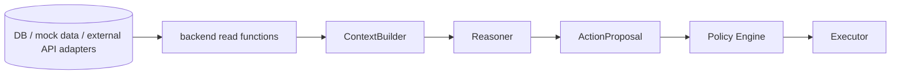

# 06 · Data And Tool Contracts

에이전트가 판단에 사용하는 데이터 계약입니다. 현재 구조에서 LLM은 tool을 직접 실행하지 않습니다. Backend가 DB/API/mock adapter를 읽고 정규화한 context pack을 LLM 입력으로 제공합니다.

## Capability Boundary



실행 동사(`book_*`, `submit_*`, `transfer_*`, `change_*`)는 LLM에 주지 않습니다. LLM은 `ActionProposal`을 만들고, 실제 실행은 승인 후 Executor가 수행합니다.

## Backend Read Functions

현재 데이터 조회/정규화 함수는 `app/tools/data_tools.py`에 있습니다.

| 함수 | 목적 |
|---|---|
| `build_context` | 고객 판단용 기본 context pack |
| `get_customer_profile` | 기본 고객 정보 |
| `get_health_data` | 동의된 건강 기록과 건강 이벤트 |
| `get_insurance_summary` | 보험 목록, 보장, 보장 공백 |
| `get_portfolio_summary` | 자산 배분, 총자산, 위험 비중 |
| `get_asset_events` | 포트폴리오 손실, 소비 급증 등 자산 이벤트 |
| `get_account_balances` | 계좌 잔액 정규화 |
| `get_account_transactions` | 거래내역/지출 요약 |
| `get_card_bills` | 카드 청구 요약 |
| `get_loan_status` | 대출 현황 |
| `get_loan_switch_precheck` | 대출이동 사전조회 mock |
| `get_customer_memory` | 장기 선호/제약/지불의향 |
| `get_population_stat` | 통계 기준값 |

외부 API 원문 request/response shape는 [`APIs/`](APIs/)에 보관합니다. MVP에서는 실제 외부 API 호출 대신 이 shape를 참고해 mock 데이터를 채우고, backend read function이 agent용 정규화 결과를 만듭니다.

## ContextBuilder Contract

`app/agent/context_builder.py`는 다음을 한 번에 묶습니다.

```text
customer context
session state
recent conversation
previous judgments/plans
proposal approval history
event timeline
policy_docs excerpts
```

LLM에 모든 DB row를 던지지 않습니다. 필요한 항목을 제한하고, 민감 식별자와 provider 내부 식별자는 제거합니다.

## Policy Documents

`policy_docs/`에는 회사 내규, 보험 검토 기준, 투자/리밸런싱 제한, 질병별 재무 대응 playbook 같은 문서를 둡니다.

현재 ContextBuilder는 `.md`, `.txt` 파일만 읽고, 문서 수와 글자 수를 제한합니다.

정책 문서에 넣기 좋은 것:

- 의료 권고 금지 문구와 표현 금지 규칙
- 보험 보장 공백 판단 기준
- 대출/현금흐름 위험 판단 기준
- 투자전략 조정의 기본 우선순위
- 치매, 간암, 폐암 등 질병별 재무 시나리오 playbook
- 회사 상품 권유 제한과 승인 필요 기준

## Data Exposure Rules

- 모든 고객 데이터는 인증된 customer/session scope에서만 조회합니다.
- access token, 계좌번호, 카드 식별자, 외부 provider raw id는 LLM context에 넣지 않습니다.
- 건강 데이터는 consent 없는 record를 제외합니다.
- 통계는 출처와 기준일을 함께 유지합니다.
- 큰 문서는 전문을 무제한 주입하지 않고, 정책 파일/요약/발췌 단위로 제한합니다.

## Test Points

- 실행 도구가 LLM 표면에 노출되지 않음
- consent 없는 건강 데이터 미반환
- provider 내부 식별자 제거
- context pack에 최근 대화와 판단 기록 포함
- policy 문서는 `.md`, `.txt`만 포함
