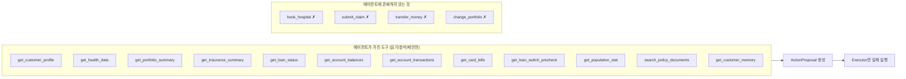

# 06 · 도구 계약 (Tool Contracts)

에이전트에 노출하는 도구를 정의합니다. **핵심 불변식: 에이전트 도구는 읽기·분석·제안만 가능하고, 실행 권한은 없습니다.**

## Capability 경계



실행 동사(`book_*`, `submit_*`, `transfer_*`, `change_*`)는 **도구 목록에 아예 없습니다.** 에이전트는 "병원 예약하자"는 **제안(ActionProposal)** 만 만들 수 있고, 실제 실행은 [07_ACTION_EXECUTION.md](07_ACTION_EXECUTION.md)의 Executor가 담당합니다.

## 노출 메커니즘 (Codex SDK 기준)

Codex SDK는 워크스페이스(파일시스템) 기반 에이전트이며 **MCP를 지원**합니다. 따라서:

| 데이터 분류 | 노출 방식 | 샌드박스 |
|---|---|---|
| ① 고객 개인 (동적) | **MCP 읽기 도구 서버** (우리 백엔드가 제공) | 읽기 전용 도구 |
| ② 통계/기준 | **MCP 읽기 도구** (파라미터 쿼리) | 읽기 전용 도구 |
| ③ 규정·약관 (정적) | **read-only 워크스페이스 파일** | `Sandbox.read_only` |

> 에이전트 thread는 항상 `Sandbox.read_only`로 시작합니다. 기본 워크스페이스에는
> `context_manifest.json`과 정적 규정 파일만 두고, 동적 고객 데이터는 MCP read tools로 읽습니다.
> `CODEX_WORKSPACE_INCLUDE_SNAPSHOTS=true`일 때만 제한된 JSON 스냅샷 fallback을 생성합니다.
> 다른 고객 데이터는 워크스페이스에 두지 않습니다 (격리). 자세히는 [CODEX_ADAPTER.md](CODEX_ADAPTER.md).

정적 규정/약관/반복 정책 문서는 `policy_docs/` 아래에 둡니다. Codex workspace에는 `.md`, `.txt`,
`.json` 파일만 `static_context/`로 복사되며, 코드/실행 파일은 복사하지 않습니다.

현재 구현:
- MCP stdio 서버: `python -m app.mcp.read_server`
- tool registry: `app/mcp/read_tools.py`
- Codex 등록: `CodexReasoner`가 `thread_start`/`thread_resume`의 `config.mcp_server_config`에
  `jbwm-read-tools`를 추가
- 고객 scope: `JBWM_MCP_CUSTOMER_ID` env로 고정. 모델이 tool argument에 `customer_id`를 넣어도 무시
- 감사: `JBWM_MCP_SESSION_ID`가 있으면 모든 tool call을 `AgentEvent(type="tool_call")`로 저장

## 도구 목록 (① 고객 개인)

모든 고객 도구는 **`customer_id`로 스코핑**됩니다. `get_all_*` 같은 광범위 도구는 금지.

외부 금융 API의 원문 request/response shape는 [`APIs/`](APIs/)에 보관합니다.
MVP에서는 실제 외부 API를 호출하지 않고, 해당 shape를 기준으로 mock adapter를 만듭니다.
agent tool은 provider 원문 응답을 그대로 노출하지 않고, [`APIs/AGENT_TOOL_MAPPING.md`](APIs/AGENT_TOOL_MAPPING.md)의
정규화된 read tool 결과만 제공합니다.

### get_customer_profile
```
입력:  { customer_id: str }
출력:  { name, age_band, locale }
용도:  기본 컨텍스트
```

### get_health_data
```
입력:  { customer_id: str, metric?: str, since?: date }
출력:  { records: [{ source, metric, value, measured_at }], events: [{ kind, severity, detected_at }] }
용도:  건강 상태·이벤트 확인
주의:  consent 없는 데이터는 반환하지 않음 (10 참고)
```

### get_portfolio_summary
```
입력:  { customer_id: str }
출력:  { total_value, allocation: [{ asset_type, risk_grade, weight }], high_risk_weight }
용도:  자산 배분·위험도 분석
```

### get_asset_events
```
입력:  { customer_id: str, since?: date }
출력:  { events: [{ kind, severity, detected_at }] }   # portfolio_loss, spending_spike, repayment_pressure ...
용도:  선제 감지된 자산 변동 확인 (능동성 메인 트리거 — 05 AssetEvent)
```

### get_insurance_summary
```
입력:  { customer_id: str }
출력:  { policies: [{ type, coverages: [{ coverage_type, limit_amount, active }] }], gaps_hint }
용도:  보장 범위·공백 분석
```

### get_loan_status
```
입력:  { customer_id: str }
출력:  { loans: [{ balance, next_due_date, monthly_payment }], cashflow_risk_window }
용도:  현금흐름 리스크 계산
```

### get_account_balances / get_account_transactions
```
입력:  { customer_id: str, from?: date, to?: date }
출력:  정규화된 계좌 잔액·거래내역 요약 (APIs/AGENT_TOOL_MAPPING.md)
용도:  현금흐름, 유동성, 의료비/고정비 지출 감지
주의:  access_token, fintech_use_num, 계좌번호는 agent에 노출하지 않음
```

### get_card_bills
```
입력:  { customer_id: str, from_month?: str, to_month?: str }
출력:  정규화된 카드 청구 기본/상세 요약
용도:  다음 달 결제 예정액, 의료비/고정비 카드 지출 감지
```

### get_loan_switch_precheck
```
입력:  { customer_id: str, loan_id: str }
출력:  대출이동 사전조회 mock 결과 (상환 가능 여부, 중도상환수수료 등)
용도:  대환 가능성 참고. 실제 대환 실행은 Executor only
```

### get_customer_memory
```
입력:  { customer_id: str }
출력:  {
        medical_willingness,
        medical_one_time_budget_krw,
        monthly_medical_budget_krw,
        medical_budget_ratio,
        risk_preference,
        hospital_preference,
        investment_style,
        constraints
      }
용도:  개인화 (계획 생성 시 반영, 지불의향 포함) — 08 참고
```

> **의료 경계**: 어떤 도구도 의료 권고를 생성하지 않습니다. 건강·통계 도구는 *참고 정보*만 제공하며, 출력은 재무 대비·통계 인용·전문가 연결로 한정됩니다 ([10](10_SECURITY_PRIVACY.md)).

## 도구 목록 (② 통계/기준)

### get_population_stat
```
입력:  { age_band: str, metric: str }
출력:  { value, source, as_of }
용도:  "68세 평균 자산 대비…" 같은 근거 있는 비교
예:    get_population_stat(age_band="65-69", metric="avg_assets")
출처:  KOSIS, 가계금융복지조사, 보험개발원(KIDI), KNHANES (공개 데이터)
```

> 통계는 RAG가 아니라 **정형 쿼리**입니다 ([02](02_SYSTEM_ARCHITECTURE.md) 데이터 3분류 참고). 방대한 통계를 통째로 프롬프트에 넣지 않습니다.

## 도구 목록 (③ 규정·약관 — 비정형)

### search_policy_documents
```
입력:  { query: str, doc_type?: "policy"|"rule"|"product" }
출력:  { excerpts: [{ heading, text, source }] }
용도:  약관/내규 검색
MVP:   read-only 워크스페이스 파일 키워드 검색
나중:  벡터 RAG로 고도화
```

## 출력 도구 (제안 기록)

### propose_action (개념)
LLM이 실제로 호출하는 것은 도구라기보다 **구조화 출력**입니다 ([04](04_AGENT_RUNTIME.md) `Plan`/`ActionProposal`). 에이전트는 `ActionProposal`을 생성할 뿐 실행하지 않습니다. Orchestrator가 이를 받아 Policy/Executor로 보냅니다.

## 도구 스코핑·검증 규칙

- 모든 입력은 Pydantic으로 검증한다.
- 모든 고객 도구는 인증된 사용자·고객·세션으로 스코핑한다.
- 광범위/무제한 도구(`get_all_customer_data`, 임의 파일시스템 쓰기)는 노출하지 않는다.
- 도구는 간결한 결과를 반환한다 (큰 문서 전체 반환 금지 — 발췌·요약).
- 모든 도구 호출은 `AgentEvent`로 로깅한다 ([05](05_DATA_MODEL.md)).

## 테스트 포인트

- 입력 검증·스코핑 (다른 customer_id 접근 차단)
- consent 없는 건강 데이터 미반환
- 실행 도구가 에이전트 표면에 노출되지 않음 (capability 회귀 테스트)
