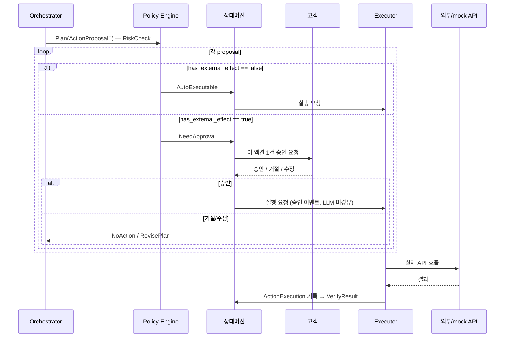
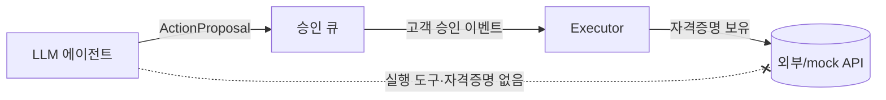

# 07 · Policy Engine & Executor

이 문서는 **제안(proposal) → 승인 → 실제 실행** 경로를 정의합니다. 이 경로의 핵심은 **LLM이 실행에 관여하지 않는다**는 것입니다.

## 두 컴포넌트

| 컴포넌트 | 역할 | LLM 관여 |
|---|---|---|
| **Policy Engine** | 액션의 리스크를 평가 → auto vs 고객승인 라우팅 | 없음 (코드 규칙) |
| **Executor** | 승인/자동 액션의 실제 실행 (외부 API·자격증명 보유) | **없음** |

## 전체 경로



## Policy Engine

### 라우팅 규칙 (MVP)

| 조건 | 라우팅 |
|---|---|
| `has_external_effect == false` (리포트·초안·정보성 알림) | `AutoExecutable` |
| `has_external_effect == true` (예약·청구·구매·가입·송금·포트폴리오 변경) | `NeedApproval` |
| 금액 임계 초과 / 민감 도메인(의료·투자 변경) | `NeedApproval` (강제) |

```python
# app/policy/engine.py  (개념)
def evaluate(plan: Plan) -> Routing:
    for p in plan.proposals:
        if p.has_external_effect:
            return Routing(needs_approval=True, reason="external_effect")
        if p.kind in HIGH_RISK_KINDS:
            return Routing(needs_approval=True, reason="high_risk_domain")
    return Routing(needs_approval=False)
```

> 규칙은 **코드**입니다. 프롬프트로 LLM에 "조심해"라고 부탁하는 방식이 아닙니다.

### auto 허용 범위 (확정 규칙)

| 액션 종류 | 외부 효과 | 승인 |
|---|---|---|
| 분석 리포트 표시, 초안 생성, 정보성 알림 | 없음 | 불필요 (auto) |
| 병원 예약 확정, 보험 청구 제출, 상품 가입, 송금, 포트폴리오 변경 | 있음 | **항상 고객 OK** |

## Executor — 결정론적 실행

### 왜 분리하는가

에이전트(LLM)는 환각·프롬프트 인젝션 가능성이 있습니다. 금융/보험/의료에서 그것이 실제 실행으로 이어지면 사고입니다. 그래서 **실행 권한(자격증명·외부 API 클라이언트)을 LLM이 접근할 수 없는 Executor에만** 둡니다.



### 핸들러 구조

```python
# app/executor/handlers.py  (개념)
class ActionHandler(Protocol):
    kind: str
    async def execute(self, proposal: ActionProposal) -> ActionExecution: ...

# 등록 예시
REGISTRY = {
    "book_hospital":     HospitalBookingHandler(),   # MVP: mock
    "submit_claim":      InsuranceClaimHandler(),     # MVP: mock 서류 생성
    "cashflow_plan":     CashflowPlanHandler(),       # 내부 계산
    "rebalance_portfolio": RebalanceHandler(),        # MVP: 제안서 생성
    "notify":            NotifyHandler(),
    "report":            ReportHandler(),
}
```

### 실행 규칙

- Executor는 **승인된(또는 auto) proposal에 대해서만** 동작한다. 상태머신이 보장.
- 승인은 **해당 proposal 1건에만** 유효하다. 다른 액션 실행 불가.
- 모든 실행은 `ActionExecution` 레코드를 남긴다 (성공/실패/결과).
- 실패 시 `Failed` 상태로 전이하고 사유를 기록한다.
- MVP의 외부 액션은 모두 **mock** (실제 예약/청구/거래 없음).

## 검증 (VerifyResult)

실행 후 결과를 확인하여 완료/실패를 판정하고, `UpdateMemory`로 넘어갑니다. 예약 완료 여부, 청구 접수 여부, 제안서 생성 여부 등.

## 의료 경계 (두 번째 capability 경계)

실행 경계와 별개로, **액션 자체가 의료 권고가 되어선 안 됩니다.** 의료 관련 proposal/handler는 다음으로 한정됩니다:
- 허용: 비용 대비 플랜(`cashflow_plan`), 보장 점검·청구(`review_insurance`/`submit_claim`), 정보성 통계 리포트(`report`), 전문가/병원 연결(`notify`/예약 *지원*).
- 금지: "이 치료를 받으세요" 식 처치·진단·복약 권고 생성.
- 모든 의료 관련 출력에 출처·면책을 포함. 의료 결정권은 고객·주치의. ([10](10_SECURITY_PRIVACY.md), [01](01_PRODUCT_CONTEXT.md))

## 책임소재 & 설명가능성 (평가 5.5)

- 각 액션은 **누가 언제 승인했는지**(`ApprovalDecision`)와 **무엇이 실행됐는지**(`ActionExecution`)가 분리 기록됨.
- LLM은 실행 경로에 없으므로, "AI가 멋대로 했다"가 구조적으로 불가능.
- 감사 추적: `Signal → NeedAssessment → Plan → ApprovalDecision → ActionExecution` 전 구간 `AgentEvent`로 로깅.

## 테스트 포인트

- 미승인 proposal 실행 차단
- 승인 스코핑 (proposal A 승인으로 B 실행 불가)
- auto 라우팅 정확성 (외부 효과 분류)
- 실패 전이 + 사유 기록
