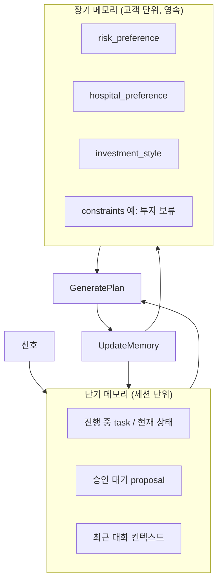

# 08 · 메모리 & 개인화

메모리는 "진짜 에이전트 느낌"을 만드는 핵심입니다. 단순 DB가 아니라, 단기 진행 상황과 장기 고객 성향을 구분해 관리하고, **장기 메모리를 모든 계획 생성에 반영**하여 개인화합니다.

## 두 종류



## 단기 메모리

`AgentSession`에 보관 ([05](05_DATA_MODEL.md)). 세션 생명주기 동안 유지.

| 항목 | 예시 |
|---|---|
| 현재 상태 | `UserApproval` |
| 활성 의도 | `{Insurance: ACTIVE, Investment: DEFERRED}` |
| 승인 대기 | `pending_proposal_id` |
| 최근 대화 | 최근 N턴 |

이것이 "그거 취소해줘 → 뭘?"을 해결합니다. 현재 대기 중인 proposal이 무엇인지 단기 메모리가 알고 있습니다.

## 장기 메모리 (개인화)

`CustomerMemory`에 영속 ([05](05_DATA_MODEL.md)). 세션을 넘어 누적.

```json
{
  "risk_preference": "low",
  "hospital_preference": "서울아산병원",
  "investment_style": "stable",
  "constraints": { "투자": "당분간 보류" }
}
```

### 개인화 동작

장기 메모리는 **`GeneratePlan`의 입력**입니다 ([04](04_AGENT_RUNTIME.md) `generate_plan(intent, memory)`). 같은 신호라도 고객마다 다른 계획이 나옵니다.

예: 혈압 상승 신호 →
- `risk_preference: low` + `constraints.투자=보류` 고객 → 투자 조정 제안 **생략**, 보험·검진만 제안
- `investment_style: aggressive` 고객 → 포트폴리오 조정도 적극 제안

## 메모리 갱신 경로

| 트리거 | 갱신 내용 |
|---|---|
| `PreferenceUpdate` (자연어로 성향 변경) | 장기: `risk_preference`, `constraints` 등 |
| `VerifyResult` 후 | 장기: 선호 학습 (예: 승인한 병원 → `hospital_preference`) |
| 승인/거절 패턴 | 장기: 어떤 제안을 자주 거절하는지 |
| 세션 진행 | 단기: 상태·대기 proposal·대화 |

### 자연어만으로 성향 변경 (중요)

데이터 변화가 없어도 고객 발화만으로 장기 메모리가 바뀝니다.

```
고객: "나 앞으로 투자는 보수적으로 갈래"
→ SignalDetected (user_utterance)
→ ClarifyUser → PreferenceUpdate
→ UpdateMemory: investment_style="stable", risk_preference="low"
→ (금융 액션 없음) → Monitoring
```

이후 모든 계획이 이 성향을 반영합니다. = 개인화.

## 누가 갱신하는가

- 메모리 **쓰기**는 백엔드(`UpdateMemory` 상태)가 수행한다.
- LLM은 메모리를 **읽기만** 한다 (`get_customer_memory` 도구, [06](06_TOOL_CONTRACTS.md)).
- 무엇을 장기 메모리에 승격할지는 코드 규칙 + (선택) LLM 요약 제안으로 결정하되, **저장 행위 자체는 코드**가 한다.

## MVP 범위

- 장기: `CustomerMemory` 테이블 + 계획 생성 시 주입
- 단기: `AgentSession.recent_context`
- 자연어 → `PreferenceUpdate` 경로 1개
- 고도화(나중): 선호 자동 학습 정교화, 벡터 기반 장기 기억

## 테스트 포인트

- 장기 메모리가 계획 생성에 실제 반영되는지 (제약 있는 고객 → 해당 제안 생략)
- 자연어 → 성향 변경 → 영속 → 다음 세션 반영
- LLM은 메모리 쓰기 불가 (읽기 도구만)
