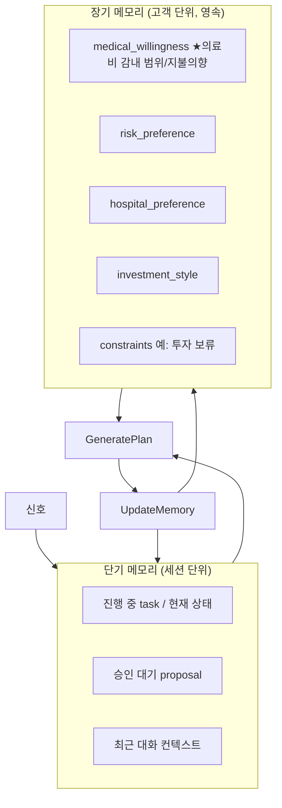

# 08 · 메모리 & 개인화

메모리는 "진짜 에이전트 느낌"을 만드는 핵심입니다. 단순 DB가 아니라, 단기 진행 상황과 장기 고객 성향을 구분해 관리하고, **장기 메모리를 모든 계획 생성에 반영**하여 개인화합니다.

## 두 종류



## 단기 메모리

`AgentSession`에 보관 ([05](05_DATA_MODEL.md)). 세션 생명주기 동안 유지.

| 항목 | 예시 |
|---|---|
| 현재 상태 | `UserApproval` |
| 활성 의도 | `{Insurance: ACTIVE, Investment: DEFERRED}` |
| 승인 대기 | `pending_proposal_id` |
| 최근 대화 | 최근 N턴 |

이것이 "그거 취소해줘 → 뭘?"을 해결합니다. 현재 대기 중인 proposal이 무엇인지 단기 메모리가 알고 있습니다.

## 장기 메모리 (개인화)

`CustomerMemory`에 영속 ([05](05_DATA_MODEL.md)). 세션을 넘어 누적.

```json
{
  "medical_willingness": "conservative",
  "medical_one_time_budget_krw": 1500000,
  "monthly_medical_budget_krw": 250000,
  "medical_budget_ratio": 0.08,
  "risk_preference": "low",
  "hospital_preference": "전북대학교병원",
  "investment_style": "stable",
  "constraints": { "투자": "당분간 보류" }
}
```

### 의료비 감내 범위 / 지불 의향 (medical_willingness) — 1급 개인화 변수

"의료/대응에 얼마까지 쓸 용의가 있는가", "어떤 부담은 심리적으로 피하고 싶은가"를
`medical_willingness`와 금액/비율 필드로 함께 표현합니다.

| 필드 | 의미 |
|---|---|
| `medical_willingness` | 정성적 지불의향: `conservative` / `moderate` / `aggressive` |
| `medical_one_time_budget_krw` | 일회성 의료비 부담 한도 |
| `monthly_medical_budget_krw` | 월 의료비/건강 관련 지출 한도 |
| `medical_budget_ratio` | 월 현금흐름 대비 의료비 부담 허용 비율 |

이것이:
- **개인화의 축**: 같은 건강·자산 상황도 지불의향에 따라 다른 제안이 나온다.
- **의료 경계의 한 축**: 회사는 "치료하세요"가 아니라 *"의료진과 상의할 비용 범위를, 당신이 정한 예산 하에서 이렇게 대비할 수 있습니다"* 라고 말한다 ([10](10_SECURITY_PRIVACY.md), [01](01_PRODUCT_CONTEXT.md)).

자산 규모와 지불의향은 다릅니다. 자산이 큰 고객도 의료비 지출에는 보수적일 수 있고,
자산이 작은 고객도 건강 관련 선택지는 넓게 열어두고 싶을 수 있습니다. 따라서
`medical_willingness`는 단순 자산 규모의 함수가 아니라 고객별 장기 메모리입니다.

### 개인화 동작

장기 메모리는 **`GeneratePlan`의 입력**입니다 ([04](04_AGENT_RUNTIME.md) `generate_plan(assessment, memory)`). 같은 신호라도 고객마다 다른 계획이 나옵니다.

예: 자산 손실 + 의료비 대비 필요 신호 →
- `medical_willingness: conservative` + `constraints.투자=보류` 고객 → 기본 검사/상담 비용 범위 중심, 보험·비상자금 우선, 투자 조정·고비용 대비는 soft CTA로만 제안
- `medical_willingness: aggressive` + `investment_style: aggressive` 고객 → 정밀검사/입원 가능성까지 넓은 비용 범위를 열어두고, 보험·현금·투자 유동화 시나리오도 함께 제안

## 메모리 갱신 경로

| 트리거 | 갱신 내용 |
|---|---|
| `PreferenceUpdate` (자연어로 성향 변경) | 장기: `risk_preference`, `constraints` 등 |
| `VerifyResult` 후 | 장기: 선호 학습 (예: 승인한 병원 → `hospital_preference`) |
| 승인/거절 패턴 | 장기: 어떤 제안을 자주 거절하는지 |
| 세션 진행 | 단기: 상태·대기 proposal·대화 |

### 성향 변경은 자연어의 *한 갈래* (전부가 아님)

자연어 입력은 1급 트리거이고, 발화 내용에 따라 액션(→승인)으로도, 성향 변경으로도 이어집니다 ([03](03_STATE_MACHINE.md) "자연어 입력은 1급 트리거다"). 아래는 **발화가 순전히 성향/지불의향 변경일 때**의 경로입니다.

```
고객: "의료엔 큰 비용 부담스러워. 투자도 보수적으로."
→ SignalDetected (user_utterance)
→ ClarifyUser → PreferenceUpdate
→ UpdateMemory: medical_willingness="conservative", investment_style="stable"
→ (액션 불필요) → Monitoring
```

반면 "다음 달 큰 지출 예정"처럼 **액션이 필요한 발화**는 `GeneratePlan → RiskCheck → 승인`으로 갑니다(성향 변경 아님). 이후 모든 계획이 갱신된 성향을 반영합니다. = 개인화.

## 누가 갱신하는가

- 메모리 **쓰기**는 백엔드(`UpdateMemory` 상태)가 수행한다.
- LLM은 메모리를 **읽기만** 한다 (`get_customer_memory` 도구, [06](06_TOOL_CONTRACTS.md)).
- 무엇을 장기 메모리에 승격할지는 코드 규칙 + (선택) LLM 요약 제안으로 결정하되, **저장 행위 자체는 코드**가 한다.

## MVP 범위

- 장기: `CustomerMemory` 테이블 + 계획 생성 시 주입
- 단기: `AgentSession.recent_context`
- 자연어 → `PreferenceUpdate` 경로 1개
- 고도화(나중): 선호 자동 학습 정교화, 벡터 기반 장기 기억

## 테스트 포인트

- 장기 메모리가 계획 생성에 실제 반영되는지 (제약 있는 고객 → 해당 제안 생략)
- 자연어 → 성향 변경 → 영속 → 다음 세션 반영
- LLM은 메모리 쓰기 불가 (읽기 도구만)
