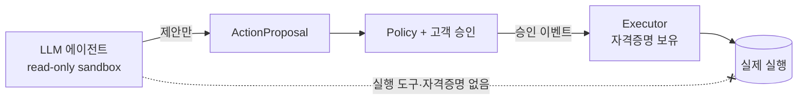
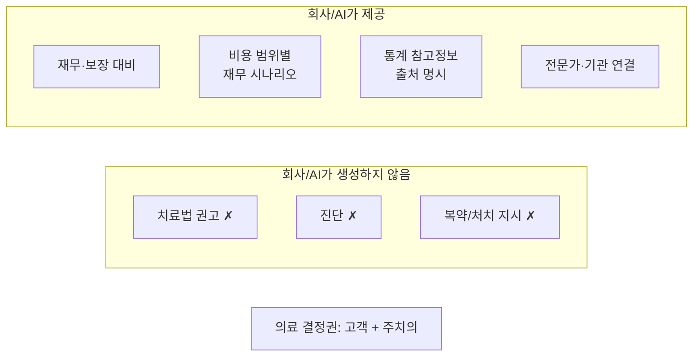

# 10 · 보안 & 개인정보

금융·보험·의료 데이터를 다루므로 규제·보안·내부통제가 1급 관심사입니다 (평가 2.4, 5.5). MVP에서도 **인식과 구조**를 명확히 보여줍니다.

이 시스템의 안전은 "LLM에게 잘 부탁하기"가 아니라 **두 개의 권한 경계**에서 나옵니다.

## 1. 실행 경계 — AI는 실행 권한이 없다



| 원칙 | 구현 |
|---|---|
| 에이전트는 실행 권한이 없다 | 실행 도구를 도구 목록에서 제외 ([06](06_TOOL_CONTRACTS.md)) |
| 에이전트는 쓰기를 못 한다 | `Sandbox.read_only` + 읽기 전용 MCP |
| 승인은 액션 1건 스코핑 | `ApprovalDecision`이 `proposal_id`에 종속 ([05](05_DATA_MODEL.md)) |
| 실행은 LLM을 거치지 않는다 | 승인 이벤트 → Executor 직행 ([07](07_ACTION_EXECUTION.md)) |
| 프롬프트 인젝션 내성 | 인젝션이 성공해도 실행 도구가 없어 무해 |

→ "AI가 멋대로 송금/가입했다"가 **구조적으로 불가능**.

## 1-2. 의료 경계 — AI/회사는 의료 권고를 생성하지 않는다

승인 게이트는 "누가 *실행*하나"는 풀지만, **"이 치료를 받으세요" 같은 의료 권고를 *생성*한 책임**은 풀지 못합니다. 고객이 클릭해도 시스템이 의료 권고를 만든 사실은 남기 때문입니다. 그래서 **두 번째 경계**를 둡니다.



| 원칙 | 구현 |
|---|---|
| 의료 권고를 생성하지 않는다 | reasoner 출력 스키마·프롬프트가 "재무·통계·연결·비용 범위별 시나리오"로 한정 ([04](04_AGENT_RUNTIME.md)). `medical_cost_need`는 *의료비 감내 범위 설계*이지 처치 권고가 아님 |
| 통계는 참고정보로만 | `get_population_stat` 결과에 **출처·기준시점** 동반 ([06](06_TOOL_CONTRACTS.md), [STATS_SOURCES](STATS_SOURCES.md)) |
| 의료 결정권은 고객·주치의 | 모든 의료 관련 출력에 면책·전문가 연결 안내 |

> "이 치료를 받으세요"(❌) → "의료진과 상의할 선택지의 비용 범위는 이렇게 나눠볼 수 있고, *당신이 정한 예산·지불의향* 하에서는 재무적으로 이렇게 대비됩니다"(✅). 부담을 **안전장치로 전환**합니다.

허용되는 의료 관련 출력은 **선택지를 의학적으로 서열화하지 않는 비용·준비 정보**입니다.
예: 기본 검사/추적 관찰 중심, 추가 정밀검사 포함, 입원·시술 가능성까지 고려한 비용 범위.
각 범위에 대해 현금흐름, 보험 보장, 자기부담 가능성, 투자 유동화 필요성, 주치의에게 확인할
질문을 정리할 수 있습니다.

→ 두 경계가 함께 책임소재(5.5)·내부통제(2.4)의 답입니다.

## 2. 개인정보 / 건강정보 규제 인식

| 데이터 | 규제 | 본 시스템의 처리 |
|---|---|---|
| 금융/신용 정보 | 신용정보법, 마이데이터(본인신용정보관리업) | 본인 동의 기반. MVP는 mock |
| 건강/의료 정보 | 개인정보보호법(PIPA) 민감정보, 의료법 | **본인이 직접 제공·동의**한 데이터만 저장 ([05](05_DATA_MODEL.md) `consent_id`) |
| 온디바이스 헬스 | HealthKit/삼성헬스 약관 | 본인 동의 동기화 (MVP: 직접 입력) |
| 금융 자문 | 금융소비자보호법 적합성·설명의무 | 항상 인간 승인 + 근거 기록 |

### 건강정보 처리 원칙

- 건강 데이터는 **고객이 직접 제공·동의한 것만** 저장한다 (법적으로 제3자 자동 수집은 제한적).
- 모든 건강 레코드는 `consent_id`로 동의 근거를 추적한다.
- consent 없는 데이터는 도구가 반환하지 않는다 ([06](06_TOOL_CONTRACTS.md) `get_health_data`).

### 객관 ↔ 주관 분리 (왜곡 방지)

같은 질병도 개인 인지·성격·체감에 따라 진술이 크게 달라질 수 있습니다. **그 주관이 실제 질병 크기를 뛰어넘어 판단을 왜곡하면 안 됩니다.** 그래서:

| 구분 | 출처 | 쓰임 |
|---|---|---|
| **객관 의료 사실** | 제출된 **진단서·검진 내역**(`MedicalDocument`) + 통계 | 질병·리스크 **평가의 앵커** |
| **주관** | 자연어 발화 → 인지·성격·**의료비 감내 범위/지불의향**(`CustomerMemory`) | **대응의 개인화**에만 (질병 평가엔 안 씀) |

→ 회사는 *채팅으로 병을 진단·평가하지 않고*, 객관 문서 + 통계로 **재무 대비**만 합니다. 이것이 의료 경계를 더 단단하게 합니다.

### 보유기간 & 파기 (잊힐 권리)

고객 데이터(가입 시 제공 + 이후 변동·이력 + 개인화)는 **누적·영속**되지만 ([05](05_DATA_MODEL.md) 데이터 영속성), 이는 **동의 범위·보유기간 내**에서만입니다.

- 보유기간 만료 또는 **동의 철회 시 파기**(개인정보보호법, 잊힐 권리).
- 건강·의료는 민감정보라 보유·접근을 더 엄격히 제한한다.
- 감사 이력(append-only)도 법정 보유기간을 넘기면 익명화/파기 대상.
- MVP는 저장만 구현하되 이 원칙을 문서·설계에 반영한다 (평가 2.4).

## 3. 데이터 격리

- 에이전트 워크스페이스에는 **현재 고객의 스냅샷만** 둔다. 다른 고객 데이터 금지.
- MCP 도구는 인증 주체의 `customer_id`로 스코핑한다.
- `get_all_*` 같은 광범위 접근 금지.

## 4. 인증 / 인가

| 역할 | 권한 |
|---|---|
| 고객 | 본인 데이터 조회, 본인 proposal 승인/거절 |
| 어드바이저 | 담당 고객 모니터링, 제한적 개입 |
| 운영자 | 규정·통계·정책 규칙 관리 (고객 데이터 직접 접근 최소화) |

MVP: 세션 또는 JWT. 시크릿은 환경변수 ([ENVIRONMENT_VARIABLES.md](ENVIRONMENT_VARIABLES.md)), 소스/문서에 하드코딩 금지.

## 5. 설명가능성 & 감사 (평가 5.5)

전 구간을 추적합니다:

```
Signal → NeedAssessment(rationale) → Plan(explanation) → ApprovalDecision(누가/언제) → ActionExecution(무엇을)
```

- 각 의도·계획에 **근거(rationale)** 가 기록됨 → 왜 이 제안을 했는지 설명 가능.
- 승인과 실행이 분리 기록됨 → 책임소재 명확.
- 모든 단계가 `AgentEvent`로 로깅 → 사후 감사.

## 6. 환각 대응

- LLM 판단을 **통계 기준 데이터에 앵커링** ([06](06_TOOL_CONTRACTS.md) `get_population_stat`).
- 구조화 출력 + Pydantic 검증으로 비정상 출력 차단.
- 결정론적 FSM/Policy가 LLM 출력을 그대로 신뢰하지 않음 (게이트 통과 필요).

## 7. 비밀 관리

- `.env` (gitignore). `.env.example`만 커밋.
- Codex 인증은 OAuth 세션(`codex login`) 기반, API 키 하드코딩 불필요 ([CODEX_ADAPTER.md](CODEX_ADAPTER.md)).

## MVP에서 보여줄 것

- 실행 경계: 도구 목록에 실행 도구 부재 (capability 회귀 테스트)
- 의료 경계: 의료 권고 생성 없음 + 통계 출처 명시 + 면책 문구
- 건강 데이터 `consent_id` 필드 (본인 제공·동의)
- 감사 타임라인 (`/agent-sessions/{id}/events`)
- 통계 앵커링된 근거 표시 ([STATS_SOURCES](STATS_SOURCES.md))
