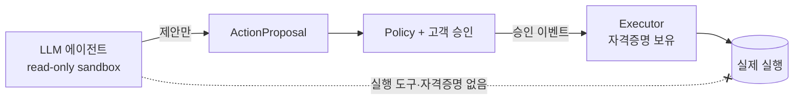

# 10 · 보안 & 개인정보

금융·보험·의료 데이터를 다루므로 규제·보안·내부통제가 1급 관심사입니다 (평가 2.4, 5.5). MVP에서도 **인식과 구조**를 명확히 보여줍니다.

## 1. Capability 기반 보안 (핵심)

이 시스템의 안전은 "LLM에게 잘 부탁하기"가 아니라 **권한 구조**에서 나옵니다.



| 원칙 | 구현 |
|---|---|
| 에이전트는 실행 권한이 없다 | 실행 도구를 도구 목록에서 제외 ([06](06_TOOL_CONTRACTS.md)) |
| 에이전트는 쓰기를 못 한다 | `Sandbox.read_only` + 읽기 전용 MCP |
| 승인은 액션 1건 스코핑 | `ApprovalDecision`이 `proposal_id`에 종속 ([05](05_DATA_MODEL.md)) |
| 실행은 LLM을 거치지 않는다 | 승인 이벤트 → Executor 직행 ([07](07_ACTION_EXECUTION.md)) |
| 프롬프트 인젝션 내성 | 인젝션이 성공해도 실행 도구가 없어 무해 |

→ "AI가 멋대로 송금/가입했다"가 **구조적으로 불가능**. 이것이 책임소재(5.5)의 답입니다.

## 2. 개인정보 / 건강정보 규제 인식

| 데이터 | 규제 | 본 시스템의 처리 |
|---|---|---|
| 금융/신용 정보 | 신용정보법, 마이데이터(본인신용정보관리업) | 본인 동의 기반. MVP는 mock |
| 건강/의료 정보 | 개인정보보호법(PIPA) 민감정보, 의료법 | **본인이 직접 제공·동의**한 데이터만 저장 ([05](05_DATA_MODEL.md) `consent_id`) |
| 온디바이스 헬스 | HealthKit/삼성헬스 약관 | 본인 동의 동기화 (MVP: 직접 입력) |
| 금융 자문 | 금융소비자보호법 적합성·설명의무 | 항상 인간 승인 + 근거 기록 |

### 건강정보 처리 원칙

- 건강 데이터는 **고객이 직접 제공·동의한 것만** 저장한다 (법적으로 제3자 자동 수집은 제한적).
- 모든 건강 레코드는 `consent_id`로 동의 근거를 추적한다.
- consent 없는 데이터는 도구가 반환하지 않는다 ([06](06_TOOL_CONTRACTS.md) `get_health_data`).

## 3. 데이터 격리

- 에이전트 워크스페이스에는 **현재 고객의 스냅샷만** 둔다. 다른 고객 데이터 금지.
- MCP 도구는 인증 주체의 `customer_id`로 스코핑한다.
- `get_all_*` 같은 광범위 접근 금지.

## 4. 인증 / 인가

| 역할 | 권한 |
|---|---|
| 고객 | 본인 데이터 조회, 본인 proposal 승인/거절 |
| 어드바이저 | 담당 고객 모니터링, 제한적 개입 |
| 운영자 | 규정·통계·정책 규칙 관리 (고객 데이터 직접 접근 최소화) |

MVP: 세션 또는 JWT. 시크릿은 환경변수 ([ENVIRONMENT_VARIABLES.md](ENVIRONMENT_VARIABLES.md)), 소스/문서에 하드코딩 금지.

## 5. 설명가능성 & 감사 (평가 5.5)

전 구간을 추적합니다:

```
Signal → Intent(rationale) → Plan(explanation) → ApprovalDecision(누가/언제) → ActionExecution(무엇을)
```

- 각 의도·계획에 **근거(rationale)** 가 기록됨 → 왜 이 제안을 했는지 설명 가능.
- 승인과 실행이 분리 기록됨 → 책임소재 명확.
- 모든 단계가 `AgentEvent`로 로깅 → 사후 감사.

## 6. 환각 대응

- LLM 판단을 **통계 기준 데이터에 앵커링** ([06](06_TOOL_CONTRACTS.md) `get_population_stat`).
- 구조화 출력 + Pydantic 검증으로 비정상 출력 차단.
- 결정론적 FSM/Policy가 LLM 출력을 그대로 신뢰하지 않음 (게이트 통과 필요).

## 7. 비밀 관리

- `.env` (gitignore). `.env.example`만 커밋.
- Codex 인증은 OAuth 세션(`codex login`) 기반, API 키 하드코딩 불필요 ([CODEX_ADAPTER.md](CODEX_ADAPTER.md)).

## MVP에서 보여줄 것

- Capability 보안 다이어그램 + 실제 도구 목록에 실행 도구 부재
- 건강 데이터 `consent_id` 필드
- 감사 타임라인 (`/agent-sessions/{id}/events`)
- 통계 앵커링된 근거 표시
