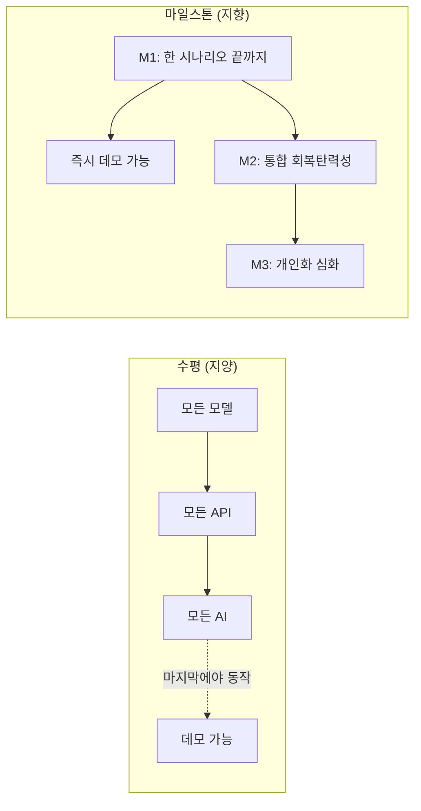

# 11 · 구현 로드맵 (MVP 마일스톤)

해커톤은 "완성도 높은 일부"가 "미완성 전체"를 이깁니다. 그래서 **수평**(모든 테이블 → 모든 API → 모든 AI)이 아니라 **MVP 마일스톤**(시나리오 하나를 끝까지)으로 갑니다.

## 수평 vs 수직



## M1 — 핵심 루프 1바퀴 ✅ (완료)

건강 트리거로 승인/실행 안전 루프를 끝까지 관통합니다. StubReasoner로 종단 동작·테스트 완료.

```
Monitoring → (mock 신호: 혈압상승) → SignalDetected → AssessNeed(insurance_need=high)
→ GeneratePlan → RiskCheck → NeedApproval → UserApproval(승인)
→ ExecuteAction(mock 청구서류) → VerifyResult → UpdateMemory → Monitoring
```

구현 순서:
1. 프로젝트 스캐폴드 + `/health`
2. DB 연결 + 핵심 모델 (Customer, Health*, Insurance*, AgentSession, ActionProposal)
3. mock 시드 데이터 1명 (김영자, 68세)
4. 상태머신 골격 (전이 + 가드)
5. `AgentReasoner` 포트 + **Codex 어댑터** (read-only sandbox)
6. MCP 읽기 도구: `get_health_data`, `get_insurance_summary`, `get_customer_memory`
7. Orchestrator: 신호 → 의도추론 → 계획 → RiskCheck
8. Policy Engine + Executor (mock 청구서류 핸들러)
9. API: 세션 생성, 신호 주입, 세션 조회, proposal 승인
10. 결과 화면용 이벤트 타임라인

**완료 기준**: 위 한 바퀴가 실제로 돌고, 프론트에서 알림→승인→결과 1장이 보임.

## M2 — 자산 트리거 + 통합 회복탄력성 ✅ (완료)

통합 개념의 **메인 데모**. 자산 변동 선제 감지로 건강·자산을 묶어 판단. StubReasoner로 종단 동작·테스트 완료.

```
Monitoring → (mock 신호: portfolio_loss) → SignalDetected → AssessNeed(cashflow_need=high, asset_defense_need=high)
→ GeneratePlan(통계 앵커 + 지불의향·제약 반영) → RiskCheck
→ report·cashflow_plan(자동) + review_insurance(승인 대기)
→ 승인 → ExecuteAction → VerifyResult → UpdateMemory → Monitoring
```

구현됨:
- `AssetEvent` + 자산 트리거(`portfolio_loss` 등) → `AssessNeed`
- `MedicalDocument`(객관 문서) · `PopulationStat`(통계) 모델 + 시드
- 도구: `get_portfolio_summary`, `get_asset_events`, **`get_population_stat`**(출처 동반)
- **통계 앵커링**: "65–69 권장 비상자금 6개월(KOSIS) 대비 부족" 식 근거
- **지불의향(`medical_willingness`) + 제약 개인화**: '투자 보류' → 리밸런싱 제안 제외
- 다중 액션 카드 + 테스트 2개 (자산 트리거 종단 / 통계 도구)

남은 것 (후속 마일스톤): 투자전략/장기 생애설계 필요도에 따른 계획 분기, 의료비 감내 범위 기반 시나리오 고도화, 통계 항목 다양화.

## M3 — 명확화 & 개인화 심화

- `AssessNeed → ClarifyUser` 대화 분기
- `PreferenceUpdate` (자연어로 지불의향·성향 변경 → 장기 메모리)
- 장기 메모리(지불의향 포함)를 계획에 반영 (개인화 입증)

## M4 — 자동/수정 분기

- `RiskCheck → AutoExecutable` (부작용 없는 액션 자동)
- `UserApproval → RevisePlan` 수정 루프
- 병렬 필요도 서브상태 (ACTIVE/DEFERRED/PENDING)

## M5 — 고도화 (시간 여유 시)

- 능동 모니터링: 스케줄러/이벤트 큐 (Redis + RQ) — 자산 트리거 실시간화
- 진행 상황 스트리밍 (SSE)
- 규정 검색 RAG (벡터)
- 실시간 통계 API 연동 ([STATS_SOURCES](STATS_SOURCES.md): KOSIS/ECOS/HIRA)

## 우선순위 원칙

| 우선 | 이유 |
|---|---|
| M1 완성 | 데모 영상(가점 5점) + MVP 동작(20점)의 최소 단위 |
| Capability 보안 가시화 | 평가 2.4/5.5 직결, 구현 비용 낮음 |
| 통계 앵커링 | 평가 3.5/5.5, 차별성 |
| i18n/스트리밍/RAG | 나중 (구조만 대비) |

## 비기능 항목 (각 마일스톤에 포함)

- 상태 전이·도구 스코핑 단위 테스트
- capability 회귀 테스트 (실행 도구 부재 확인)
- 구조화 로깅 (`request_id`, `customer_id`, `session_id`, `state`)
- mock 우선 (외부 API 없이 전 구간 동작)
