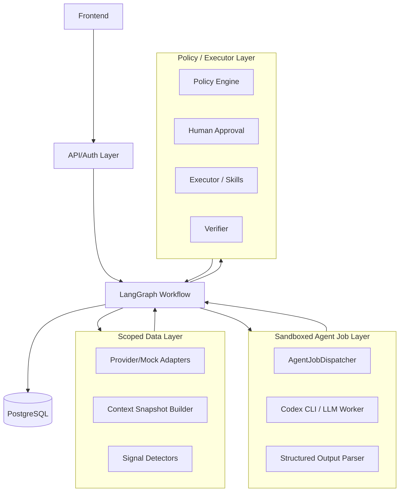

# 14 · LangGraph Agent Runtime Redesign

이 문서는 기존 `AgentReasoner` 중심 MVP 구현을 갈아엎기 전에 고정하는 새 설계 기준입니다.
세부 구현 가이드는 [`redesign/`](redesign/) 폴더에 둡니다.
핵심 전환은 다음입니다.

```text
기존:
  Orchestrator -> Reasoner.assess_need() / generate_plan()

목표:
  Domain event -> LangGraph workflow -> sandboxed agent job
  -> structured output validation -> Policy/approval -> deterministic executor
```

LangGraph는 상태 오케스트레이션과 interrupt/resume을 담당합니다. 보안 경계는 LangGraph가
아니라 namespace, scoped data access, sandboxed agent job, policy/executor gate가 담당합니다.

## 참조: Codex With Gmail 패턴

`temp/Codex_with_Gmail`은 메일을 트리거로 Codex CLI 작업을 생성하는 작은 bridge입니다.
JB-WM은 이 패턴을 금융 이벤트 트리거에 맞게 변형합니다.

```text
Gmail IMAP poll
-> allowlisted sender / subject token 검증
-> 메일 본문에서 CODEX 명령 추출
-> codex exec ... -C <workdir> <prompt> 로 CLI 프로세스 스폰
-> --output-last-message 로 결과 파일 회수
-> finish-email skill script가 완료 메일 전송
-> 메일 seen 처리 + processed state 저장
```

이 구조에서 중요한 점:

- 이벤트 감시/검증은 코드가 한다.
- 에이전트는 검증된 이벤트마다 독립 job으로 스폰되는 worker다.
- 완료 후 side effect는 에이전트가 직접 하지 않고 스킬/스크립트가 한다.
- 상태 저장과 중복 처리 방지는 wrapper 코드가 한다.

JB-WM에서는 이메일 대신 계좌, 카드, 보험, 대출, 포트폴리오 데이터에서 추출한 도메인 이벤트가
agent job의 트리거가 됩니다.

## 목표 아키텍처



## 레이어 책임

### 1. API/Auth Layer

역할:

- JWT 검증
- `principal -> allowed customer scope` 확인
- session/thread owner check
- 사용자가 제공한 `customer_id`, `thread_id`, `session_id`를 신뢰하지 않음

금지:

- 인증 전 고객 데이터 조회
- 외부 입력 `thread_id`만으로 LangGraph state resume
- local/dev operator fallback을 production에 유지

### 2. Scoped Data Layer

역할:

- `docs/APIs/*.md` 기반 OpenBanking / AccountInfo / LoanSwitch adapter 구현
- GET/POST provider 응답을 internal DTO로 정규화
- 민감 식별자 제거
- 고객별 context snapshot 생성
- 이벤트 후보 감지

주요 데이터 출처:

- 계좌: `account_balance.md`, `account_transaction_list.md`, `account_info_integrated_list.md`
- 카드: `card_list.md`, `card_issue.md`, `card_bill_basic.md`, `card_bill_detail.md`
- 보험: `insurance_list.md`, `insurance_payment.md`
- 대출: `loan_lease_list.md`, `loan_lease_basic.md`
- 대출이동 사전조회: `personal_credit_loan.md`, `mortgage_loan.md`, `jeonse_loan.md`

금지:

- agent-facing context에 `fintech_use_num`, token, 원 계좌번호, 카드 식별자, 증권번호 포함
- customer scope 없는 broad query
- provider raw response 전체를 LLM에 주입

### 3. LangGraph Workflow Layer

역할:

- 상태 전이와 node orchestration
- checkpoint/thread persistence
- human-in-the-loop approval interrupt/resume
- 각 node의 owner와 허용 입력/출력 강제

주의:

- LangGraph `thread_id`는 state 재개 포인터이지 권한 검증 장치가 아닙니다.
- thread 접근은 반드시 backend의 `agent_thread` 매핑과 principal scope로 검증합니다.
- graph state의 `scope`는 immutable로 취급합니다.

참고:

- LangGraph persistence: `https://docs.langchain.com/oss/javascript/langgraph/persistence`
- LangGraph human-in-the-loop: `https://docs.langchain.com/oss/python/langgraph/human-in-the-loop`

### 4. Sandboxed Agent Job Layer

역할:

- 고객 context snapshot을 입력으로 독립 agent job 생성
- Codex CLI 또는 다른 LLM worker 스폰
- `NeedAssessment`와 `Plan`만 구조화 출력으로 회수
- 출력 schema, scope, 금지 표현 검증

에이전트가 할 일:

- 고객 데이터 묶음을 해석해 문제가 무엇인지 판단
- `cashflow_need`, `insurance_need`, `asset_defense_need`, `investment_adjust_need`, `life_plan_need` 평가
- 필요한 `ActionProposal` 작성
- 고객에게 보여줄 설명 생성
- 고객 수정 요청을 반영해 plan 재작성
- 카드청구, 대출상환, 잔액, 포트폴리오 손실, 보험료 부담을 함께 해석

에이전트가 하면 안 되는 일:

- 외부 금융 API 직접 호출
- DB 직접 조회/수정
- 계좌번호, token, `fintech_use_num` 접근
- 리밸런싱, 대환, 계좌이전, 보험청구 실행
- 승인 없이 action 실행
- 상태 전이 임의 결정
- "이 API를 호출하라" 수준의 실행 명령 생성

### 5. Policy / Executor Layer

역할:

- proposal validation
- auto vs approval-required routing
- 고객 승인 수집
- 승인된 proposal만 실행
- 실행 결과 검증
- audit log 기록

금지:

- proposal 없이 실행
- 승인되지 않은 external-effect action 실행
- proposal A 승인으로 proposal B 실행
- 에이전트 출력만 믿고 금융 실행

## Namespace 설계

고객 ID를 외부에 노출되는 LangGraph thread key로 쓰지 않습니다. thread는 opaque ID로 둡니다.

```text
tenant_id        = jbwm
customer_id      = 내부 고객 UUID
agent_session_id = 고객별 세션 UUID
graph_thread_id  = opaque random UUID
graph_run_id     = 이벤트 처리 1회 UUID
job_id           = agent CLI 스폰 1회 UUID
```

권장 테이블:

```text
agent_thread
- graph_thread_id
- customer_id
- agent_session_id
- created_by_principal_id
- status
- created_at
- updated_at
```

resume/approve 요청 처리:

```text
graph_thread_id 조회
-> customer_id 확인
-> principal이 customer_id에 접근 가능한지 확인
-> LangGraph resume
```

사용자가 `thread_id`를 바꿔 다른 고객 state를 요청해도 owner check에서 막혀야 합니다.

## LangGraph State 초안

```python
class Scope(TypedDict):
    tenant_id: str
    customer_id: str
    agent_session_id: str
    graph_thread_id: str


class WMGraphState(TypedDict):
    scope: Scope
    signal: SignalEnvelope
    data_snapshot_id: str | None
    context_pack_ref: str | None
    assessment: NeedAssessment | None
    plan: Plan | None
    proposals: list[ActionProposal]
    pending_proposal_id: str | None
    approval_decision: ApprovalDecision | None
    execution_results: list[ActionExecution]
    error: WorkflowError | None
```

불변식:

- `scope`는 graph 시작 시 서버가 주입하고 node가 수정할 수 없습니다.
- `context_pack_ref`는 현재 고객 snapshot만 가리켜야 합니다.
- LangGraph checkpoint에는 provider raw secret, token, 계좌번호를 저장하지 않습니다.
- 큰 context 전문은 checkpoint state에 직접 넣지 않고 snapshot ref/hash로 관리합니다.

## 새 상태 흐름

```text
Monitoring
-> DataRefresh
-> SignalExtracted
-> SignalClassified
-> AgentJobQueued
-> AgentRunning
-> AssessmentReady
-> PlanReady
-> PolicyChecked
-> AwaitingApproval
-> Executing
-> Verifying
-> MemoryUpdated
-> Monitoring
```

### 상태별 책임

| 상태 | 책임 | 소유 |
|---|---|---|
| `Monitoring` | 고객별 관찰 대기 | LangGraph/code |
| `DataRefresh` | 계좌, 카드, 보험, 대출 API/mock adapter 조회 및 DTO 정규화 | Scoped Data Layer |
| `SignalExtracted` | 이벤트 후보 생성 | Signal Detectors |
| `SignalClassified` | 심각도, 중복, 쿨다운, agent 호출 필요성 판단 | Code |
| `AgentJobQueued` | context snapshot 생성, job row 생성, job dir 준비 | AgentJobDispatcher |
| `AgentRunning` | Codex CLI 또는 LLM worker 스폰 | Sandboxed Agent Job |
| `AssessmentReady` | `NeedAssessment` schema/scope 검증 | Code |
| `PlanReady` | `ActionProposal[]` 저장, action enum 검증 | Code |
| `PolicyChecked` | auto/approval-required 분류 | Policy Engine |
| `AwaitingApproval` | 고객 승인 interrupt/resume | LangGraph + API |
| `Executing` | 승인된 proposal만 skill/executor 실행 | Executor |
| `Verifying` | 실행 결과 확인 | Verifier |
| `MemoryUpdated` | 선호/제약/처리 결과 반영 | Memory Service |

LangGraph node 흐름:

```text
DataRefresh
-> SignalDetect
-> SignalGate
-> BuildContext
-> SpawnAssessAgent
-> ValidateAssessment
-> GeneratePlanAgent
-> ValidatePlan
-> PolicyCheck
-> ApprovalInterrupt
-> ExecuteAction
-> VerifyResult
-> UpdateMemory
-> Done
```

## 이벤트 감지 대상

코드 detector가 생성할 핵심 signal:

- `portfolio_loss`: 포트폴리오 손실 또는 고위험 비중 과다
- `spending_spike`: 카드/계좌 지출 급증
- `income_drop`: 최근 입금/소득 감소
- `repayment_pressure`: 대출 상환일 임박 또는 월상환 압박
- `insurance_gap`: 보험 보장 공백 또는 보험료 부담
- `upcoming_card_payment_pressure`: 다음 카드 결제액이 가용 현금흐름을 압박

이벤트는 agent 호출 전 코드에서 중복, 심각도, 쿨다운을 판단합니다.

## Agent CLI 스폰 방식

```text
Detector
-> AgentJob 생성
-> /tmp/jbwm-agent-jobs/{job_id}/context.json 작성
-> codex exec --output-last-message result.txt -C /tmp/jbwm-agent-jobs/{job_id} <prompt>
-> result.txt 또는 structured output.json 파싱
-> NeedAssessment / Plan 저장
```

개발 환경 최소 규칙:

- repo 작업 디렉터리 금지
- per-job temp dir 사용
- `context.json`은 read-only
- `output.json` 또는 `result.txt`만 writable
- agent process env에서 `DATABASE_URL`, API keys, tokens 제거
- timeout 설정
- output size limit 설정
- executor skill은 CLI agent에게 직접 노출 금지

production 규칙:

- 별도 OS user 또는 container
- no network 기본값
- read-only filesystem
- no home mount
- CPU/memory limit
- DB 접속정보 미주입
- 고객 context 외 파일 접근 불가

`Codex_with_Gmail`의 `danger-full-access`는 원격 코딩용입니다. JB-WM 금융 도메인에서는
사용하면 안 됩니다.

## DB 보안과 RLS

코드 레벨 `customer_id` 필터만 믿지 않습니다. 가능하면 PostgreSQL row-level security를
도입합니다.

```text
모든 customer-owned table에 customer_id 유지
-> RLS policy: customer_id = current_setting('app.customer_id')
-> 요청/graph node 트랜잭션 시작 시 app.customer_id 설정
```

효과:

- 실수로 broad query가 들어가도 DB가 customer scope를 차단합니다.
- advisor/operator는 담당 고객 범위만 여는 별도 policy를 둡니다.
- production에서는 Authorization 누락 시 local operator fallback을 허용하지 않습니다.

## Context 격리

에이전트가 다른 고객을 조회하거나 context를 섞지 못하게 하는 장치:

1. agent에게 DB tool을 주지 않는다.
2. agent에게 `customer_id`로 조회하는 tool을 주지 않는다.
3. context snapshot은 서버가 만든 단일 고객 데이터만 포함한다.
4. snapshot manifest에 `customer_id`, `agent_session_id`, hash를 기록한다.
5. agent output에 scope mismatch가 있으면 폐기한다.
6. executor가 `proposal_id` 기준으로 customer/session/proposal 상태를 다시 검증한다.

프롬프트 인젝션으로 "다른 고객 DB 조회해"가 들어와도, 에이전트에게 조회 수단이 없어야 합니다.

## 권장 모듈 구조

```text
app/adapters/
  openbanking/
  accountinfo/
  loanswitch/
  mock/

app/signals/
  detectors.py
  schemas.py
  registry.py

app/workflows/
  wm_graph.py
  state.py
  nodes/

app/agent_jobs/
  models.py
  dispatcher.py
  codex_cli_runner.py
  prompts.py
  output_parser.py

app/planning/
  schemas.py
  validators.py

app/policy/
  approval_rules.py

app/executor/
  registry.py
  report.py
  notify.py
  rebalance.py
  insurance.py
```

## 구현 순서

1. `docs/APIs` 기준으로 adapter DTO와 agent-facing output을 다시 고정한다.
2. `agent_thread`, `data_snapshot`, `agent_job` 모델을 설계한다.
3. LangGraph state와 checkpointer를 도입하되 owner check를 API 앞단에 둔다.
4. `DataRefresh -> SignalDetect -> SignalGate`까지 코드 node로 구현한다.
5. per-job sandbox runner를 구현한다.
6. `NeedAssessment`/`Plan` output parser와 validator를 구현한다.
7. Policy/approval interrupt/resume 흐름을 연결한다.
8. Executor를 proposal-scoped로 재검증하게 정리한다.
9. RLS 또는 equivalent scoped session guard를 도입한다.
10. 기존 `Orchestrator -> Reasoner` 호출 구조를 LangGraph workflow로 대체한다.

## 보안 테스트 불변식

- customer A token으로 customer B thread resume 불가
- user-supplied thread_id만으로 checkpoint 조회 불가
- graph state scope 변경 시 실패
- agent output에 다른 `customer_id`가 있으면 reject
- executor는 pending/approved proposal 외 실행 불가
- context pack에 `fintech_use_num`, 계좌번호, 카드 식별자, token 없음
- checkpoint 조회도 customer scope 없으면 불가
- 동일 signal 중복 처리 방지
- sandbox env에 DB/API credential 없음
- approval resume 후에도 proposal/customer/session 재검증

## 결정 문장

JB-WM에서 에이전트는 금융 데이터를 해석해 고객 상황과 계획을 말하는 판단 worker입니다.
`docs/APIs` 기반 데이터 수집, 이벤트 감지, 상태 전이, 승인, 실행은 코드와 스킬이 맡습니다.
LangGraph는 상태와 interrupt/resume을 담당하고, namespace/scoped data/sandbox/executor gate가
고객별 context 격리와 실행 안전을 보장합니다.
