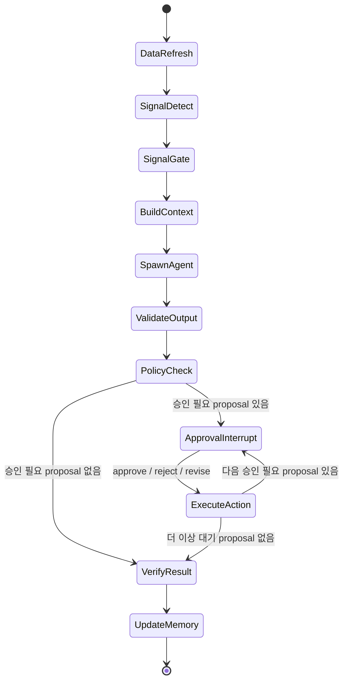
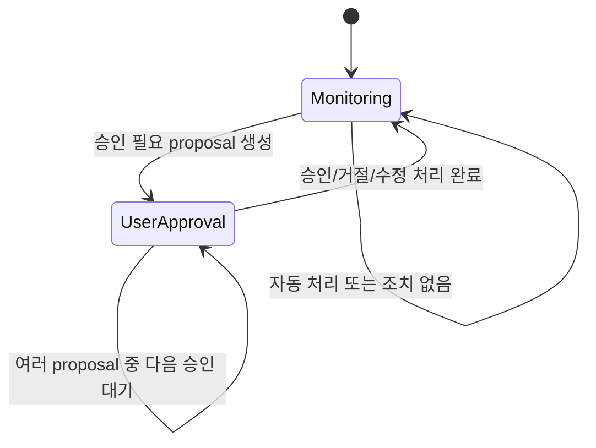

# LangGraph 상태 흐름

이 문서는 고객 이벤트가 들어왔을 때 JB-WM이 어떤 순서로 일하는지 설명한다. 화면에
보이는 "데이터 받음", "이벤트 파악", "에이전트 분석", "승인 후 실행" 같은 문구는
아래 LangGraph node와 연결된다.

## 전체 흐름

```text
Monitoring
  -> DataRefresh
  -> SignalDetect
  -> SignalGate
  -> BuildContext
  -> SpawnAgent
  -> ValidateOutput
  -> PolicyCheck
  -> ApprovalInterrupt
  -> ExecuteAction
  -> VerifyResult
  -> UpdateMemory
  -> Monitoring
```

## LangGraph FSM 다이어그램

JB-WM의 상태 흐름은 아래 LangGraph node graph를 따른다. 박스 하나는 workflow
node이며, `session.state`에 저장되는 고객 대면 상태값과 1:1로 같지는 않다.
예를 들어 내부 node는 `PolicyCheck`까지 진행하지만 고객 화면의 세션 상태는 승인
필요 시 `UserApproval`, 끝나면 `Monitoring`으로 정리된다.



고객 관점의 상태는 더 작게 표현한다.



이 구조는 FSM의 성격을 갖지만, 예전 `docs/03_STATE_MACHINE.md`처럼
`State enum -> transition table`을 직접 관리하는 방식은 아니다. 상태 흐름의 기준은
LangGraph node/edge이며, 고객 대면 상태는 workflow 결과를 사용자 언어로 요약한
표현이다.

각 단계는 한 덩어리의 "에이전트 작업"이 아니다. 코드가 먼저 데이터를 모으고
이벤트를 분류한 뒤, 그 결과를 단일 고객 context로 묶어 agent job에 넘긴다. agent는
제안만 만들고, 정책/승인/실행/확인은 코드가 이어서 처리한다.

## node별 책임

| Node | 책임 주체 | 하는 일 |
|---|---|---|
| `DataRefresh` | 코드 | scoped adapter로 계좌, 카드, 보험, 대출, 투자 데이터를 모아 snapshot을 만든다. |
| `SignalDetect` | 코드 | 받은 데이터나 사용자 입력에서 어떤 이벤트가 생겼는지 결정론적으로 분류한다. |
| `SignalGate` | 코드 | 중복 이벤트, 심각도, 쿨다운, stale data를 판단하고 agent job 실행 여부를 정한다. |
| `BuildContext` | 코드 | agent에게 줄 redacted context pack을 확정하고 hash를 남긴다. |
| `SpawnAgent` | agent job | 정제된 단일 고객 context를 읽고 need assessment와 plan을 만든다. |
| `ValidateOutput` | 코드 | Pydantic schema, action kind, 금지 id/namespace 누출 여부를 검증한다. |
| `PolicyCheck` | 코드 | 자동 내부 처리와 고객 승인 필요 proposal을 나눈다. |
| `ApprovalInterrupt` | LangGraph/API | 고객 승인이 필요한 제안에서 workflow를 멈추고 approve/reject/revise를 기다린다. |
| `ExecuteAction` | 코드/executor | 승인된 proposal만 다시 scope 확인 후 처리한다. |
| `VerifyResult` | 코드/verifier | executor 응답이 아니라 실제 저장 상태나 provider/mock 결과를 다시 확인한다. |
| `UpdateMemory` | 코드 | 처리 결과, 선호, 최근 context 요약을 다음 workflow에 반영한다. |

## 현재 코드와 목표 코드의 차이

현재 브랜치는 위 흐름의 뼈대가 이미 있다.

- `app/workflows/nodes.py`
- `app/workflows/wm_graph.py`
- `app/workflows/service.py`
- `app/agent_jobs/dispatcher.py`
- `app/executor/handlers.py`

다만 아직 얇은 부분이 있다.

- `DataRefresh`는 실제 provider fan-out이 아니라 mock DB 기반 snapshot을 만든다.
- `SignalDetect`는 rule registry가 아니라 작은 detector 함수에 가깝다.
- `ExecuteAction`은 mock/internal handler 중심이다.
- `VerifyResult`는 별도 verifier 레이어로 완전히 분리되지 않았다.

따라서 다음 재작성 단계에서는 `workflow_code_plan/`에 적은 대로 adapter,
detector, executor, verifier를 더 명확히 나누면 된다.

## 승인 대기 흐름

외부효과가 있는 proposal이 생기면 workflow는 `ApprovalInterrupt`에서 멈춘다.
이때 고객 화면에는 승인/거절/수정 버튼이 보인다. 개발자 화면(`/dev`)에는 현재
graph state, pending proposal, agent input/output, policy result가 보인다.

```text
PolicyCheck
  -> pending_proposal_id 저장
  -> session.state = UserApproval
  -> ApprovalInterrupt
  -> 고객 approve/reject/revise
  -> ExecuteAction
  -> VerifyResult
```

승인 대기 중 자유 대화는 context로 기록할 수 있지만, 그 자체가 실행 명령이 되면 안
된다. 실제 상태 전이는 approve/reject/revise API만 수행한다.

## LangGraph를 보안 장치로 착각하면 안 되는 이유

LangGraph checkpoint는 `thread_id`로 graph state를 저장하고 재개한다. 이 값은
workflow 포인터일 뿐 권한 증명이 아니다. 그래서 모든 graph invoke/resume/debug
요청은 먼저 다음 순서를 거친다.

```text
graph_thread_id 조회
  -> AgentThread.customer_id 확인
  -> principal이 해당 customer에 접근 가능한지 확인
  -> scope hash 검증
  -> LangGraph invoke/resume
```

사용자가 다른 thread id를 넣어도 이 단계에서 막혀야 한다. agent가 다른 고객 DB를
조회하려고 해도 애초에 DB credential과 조회 tool을 받지 않아야 한다.
